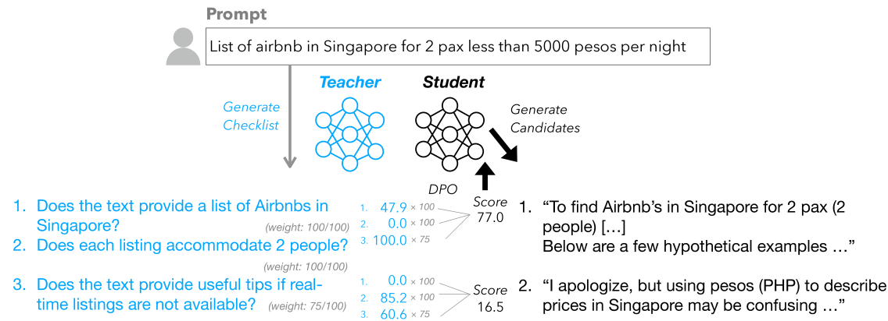
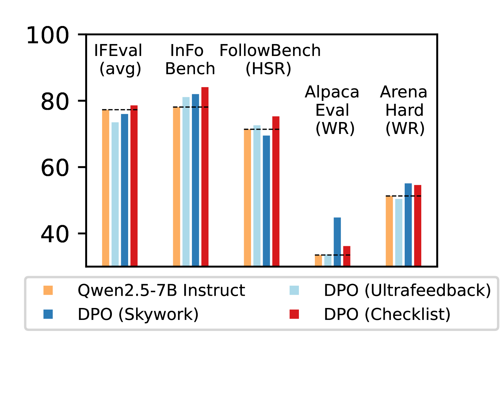

# Checklists

## 📌 核心贡献

> 提出 Reinforcement Learning from Checklist Feedback（RLCF），用 instruction-specific 的 checklist 替代传统 reward model 作为 RL 训练的反馈信号，结合 AI judge 和 verifier programs 评估每个 checklist 项，是唯一在五个 benchmark 上全部提升的方法。

## 📖 摘要

The researchers propose an alternative approach to language model alignment. Rather than using fixed criteria, they introduce "Reinforcement Learning from Checklist Feedback" (RLCF), which extracts instruction-specific checklists and evaluates responses against each item using both AI judges and specialized verifier programs. Testing on Qwen2.5-7B-Instruct across five benchmarks, RLCF improved performance on all datasets, achieving notable gains including a 4-point boost on FollowBench and 6-point increase on InFoBench.

## 🔍 关键信息

| 字段 | 内容 |
|------|------|
| 机构 | Carnegie Mellon University, Apple |
| 发表 | 2025-07-24 |
| 分类 | cs.CL |
| 链接 | [arXiv](https://arxiv.org/abs/2507.18624) |

## 📝 我的笔记

### 方法总览

### 核心问题/动机

传统 reward model 的根本问题：
1. **固定偏好**：RM 学到的是训练数据中的偏好模式，难以泛化到新指令
2. **不一致的反馈**：同一个 RM 在不同 benchmark 上可能有正有负的影响
3. **不可分解**：scalar reward 无法告诉模型哪里好、哪里差

Checklists 的核心观点：**将模糊的整体偏好判断分解为明确的 yes/no 检查项**，每个检查项可独立验证。

### 方法

#### 1. Checklist 生成（Candidate-Based）

两阶段 checklist 构建：

1. **采样候选回答**：用较小模型生成多个质量参差不齐的回答
2. **分析失败模式**：用 teacher 模型分析所有候选回答的常见问题
3. **生成 checklist**：提取可检查的需求项，每项赋予重要性权重（0-100）

这种基于候选的方法确保 checklist 覆盖真实的失败模式，而非仅描述理想情况。

#### 2. 混合评估器（Mixture-of-Evaluators）

每个 checklist 项用两种评估方式之一：

| 评估器 | 适用场景 | 方法 |
|--------|---------|------|
| **AI Judge** | 语义判断（如 "回答是否专业"） | LLM 评分 0-100，采样 25 次取均值 |
| **Verifier Program** | 硬约束（如 "包含至少 3 个字母 R"） | 生成 Python 代码验证，高置信时使用 |

Verifier program 的置信机制：模型自评能否可靠地用代码验证该项，不确定时回退到 AI judge。

#### 3. Reward 计算

最终 reward = checklist 各项加权得分的归一化：

$$r(x, y) = \frac{\sum_{i=1}^{n} w_i \cdot s_i(x, y)}{\sum_{i=1}^{n} w_i}$$

其中 $w_i$ 是重要性权重，$s_i$ 是第 $i$ 项的评分（0-100 或 0/1）。

### 关键结果

| Benchmark | 指标 | RLCF 提升 |
|-----------|------|----------|
| FollowBench | Hard Satisfaction Rate | +5.5% (相对) |
| InFoBench | Overall | +6.9% (相对) |
| Arena-Hard | Win Rate | +6.4% (相对) |
| IFEval | Loose Metrics | +2.8-3.0% (相对) |
| 全部 5 个 | — | 全部正向提升 |

关键发现：
- **RLCF 是唯一在所有 benchmark 上都带来正向提升的方法**
- 传统 reward model 在部分 benchmark 上反而降低性能
- Verifier programs 在硬约束任务上显著优于 AI judge

### 与 RaR 的对比

| 维度 | Checklists (RLCF) | RaR |
|------|-------------------|-----|
| 评估粒度 | Yes/No checklist 项 | 加权 rubric 维度 |
| 评估方式 | AI judge + verifier programs | LLM judge |
| 生成方式 | 基于候选失败分析 | 基于参考答案 |
| 聚合方式 | 显式加权求和 | 显式或隐式 |
| 核心优势 | 可程序验证硬约束 | rubric 结构灵活 |

### 总结

Checklists 的核心价值在于将 reward 的产生过程彻底解构：从 "一个模型给一个分" 变为 "多个检查项 × 多种评估器"。Verifier programs 的引入特别有意义 —— 对可形式化的约束（格式、长度、关键词等），代码验证远比 LLM 判断更可靠。这篇工作对 reward model 领域最大的挑战是：也许我们根本不需要训练一个 reward model，而是需要更好的评估分解方式。

## 🔗 相关论文

**基于/改进自：** —

**同方向：** [[RaR]], [[R3]], [[RM-R1]]
