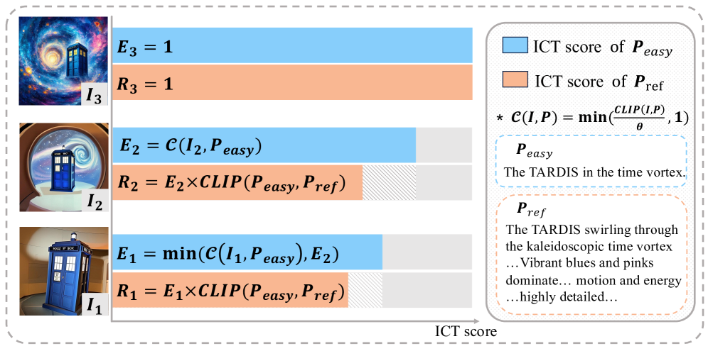
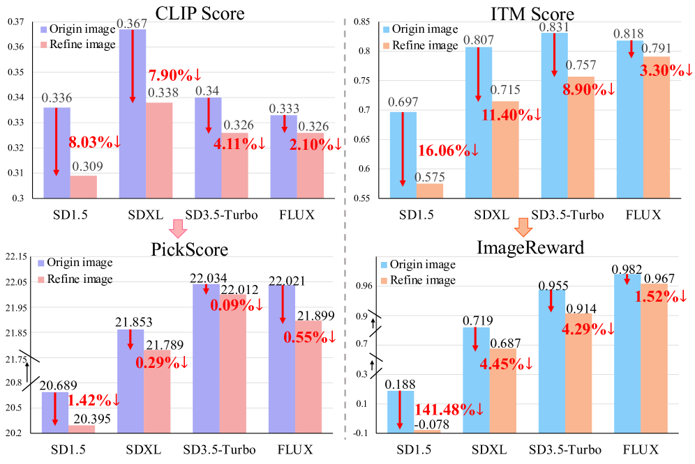
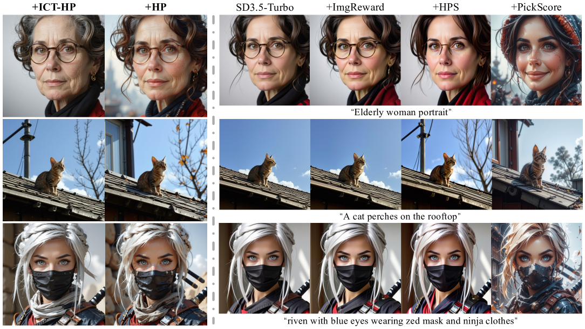

# HP Score

## 📌 核心贡献

> 揭示了基于 CLIP/BLIP 的奖励模型会不当惩罚细节丰富的高质量图像的问题，提出 image-only 的 HP 分数和 ICT（Image-Contained-Text）分数，在评分准确率上比现有方法提升超过 10%。

## 📖 摘要

The researchers identify limitations in existing evaluation frameworks for image generation. They note that current reward models based on CLIP and BLIP architectures inappropriately assign low scores to images with rich details and high aesthetic value. The team introduces two innovations: the ICT (Image-Contained-Text) score for assessing textual representation in images, and an HP (High-Preference) score model using image-only modality. Results demonstrate over 10% improvement in scoring accuracy compared to existing methods with successful optimization of state-of-the-art text-to-image models.

## 🔍 关键信息

| 字段 | 内容 |
|------|------|
| 机构 | Renmin University of China, iN2X |
| 发表 | 2025-07-25 |
| 分类 | cs.CV |
| 链接 | [arXiv](https://arxiv.org/abs/2507.19002) |

## 📝 我的笔记

### 方法总览

### 动机与问题定义

核心发现：基于 CLIP 和 BLIP 的现有奖励模型（如 PickScore、ImageReward）在评估时存在系统性偏差 -- 对细节丰富、美学价值高的图像反而给出低分。这是因为这些模型过度依赖文本-图像对齐，当图像包含超出 prompt 描述的丰富内容时，反而被惩罚。

### 方法细节

**1. ICT (Image-Contained-Text) Score:**
- 微调 CLIP-H 模型，使用 MSE 损失在三元组图像数据集上训练
- 使用双 prompt（基础和细化），评估图像中文本信息的表达质量
- 阈值对齐公式：$C(I,P) = \min(\text{CLIP}(I,P)/\theta, 1)$

**2. HP (High-Preference) Score:**
- 纯图像模态的偏好评分器，不依赖文本输入
- 使用 margin ranking loss 在偏好三元组上训练：

$$\mathcal{L}_{margin} = \sum[\max(0, -\Delta(I_2,I_1)+m) + \max(0, -\Delta(I_3,I_2)+m)]$$

**3. ICT-HP 联合模型：**

$$\text{Reward}(v,t) = \text{ICT}(v,t) \times \text{HP}(v)$$

**训练配置：**
- Stage 1：在 Pick-High 数据集 360K 三元组上微调 CLIP（40K iter，lr 3e-5）
- Stage 2：冻结 ICT，仅训练 HP 模型（50K iter，lr 3e-6）
- 扩散优化：DRaFT-K 方法在 SD3.5-Turbo 上使用 LoRA

### 关键实验结果

| 模型 | 平均准确率 | I3>I2 | I3>I1 |
|------|-----------|-------|-------|
| PickScore | 79.04% | 75.37% | 86.94% |
| **ICT-HP** | **88.84%** | **100%** | **100%** |

| 模型 | JPEG 可压缩性 | 美学分数 |
|------|-------------|---------|
| SD3.5-Turbo baseline | 313.10 | 6.293 |
| + HP | 334.86 | **6.448** |

**人工评估：** HP 模型 70.9% win rate vs baseline；ICT-HP 71.4% win rate vs PickScore

### 总结

这篇工作发现了一个重要的 reward model 偏差问题：文本-图像对齐分数会惩罚高质量图像。解决方案（纯图像 HP 分数）简洁有效，ICT-HP 联合模型在准确率和生成质量上都有显著提升。

## 🔗 相关论文

**基于/改进自：** [[HPSv2]]

**同方向：** [[HPSv3]], [[ImageReward]], [[PickScore]]
