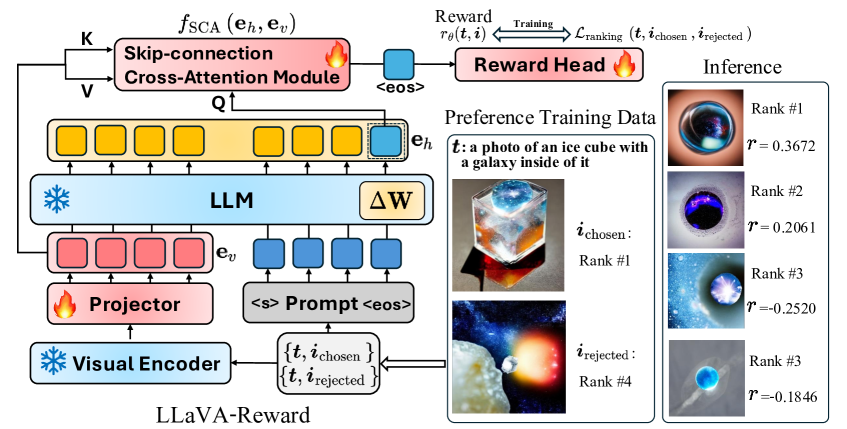
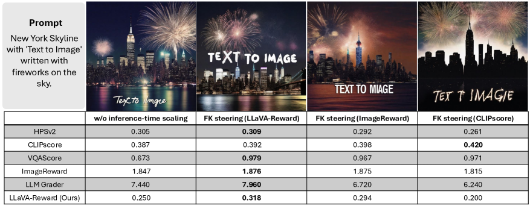
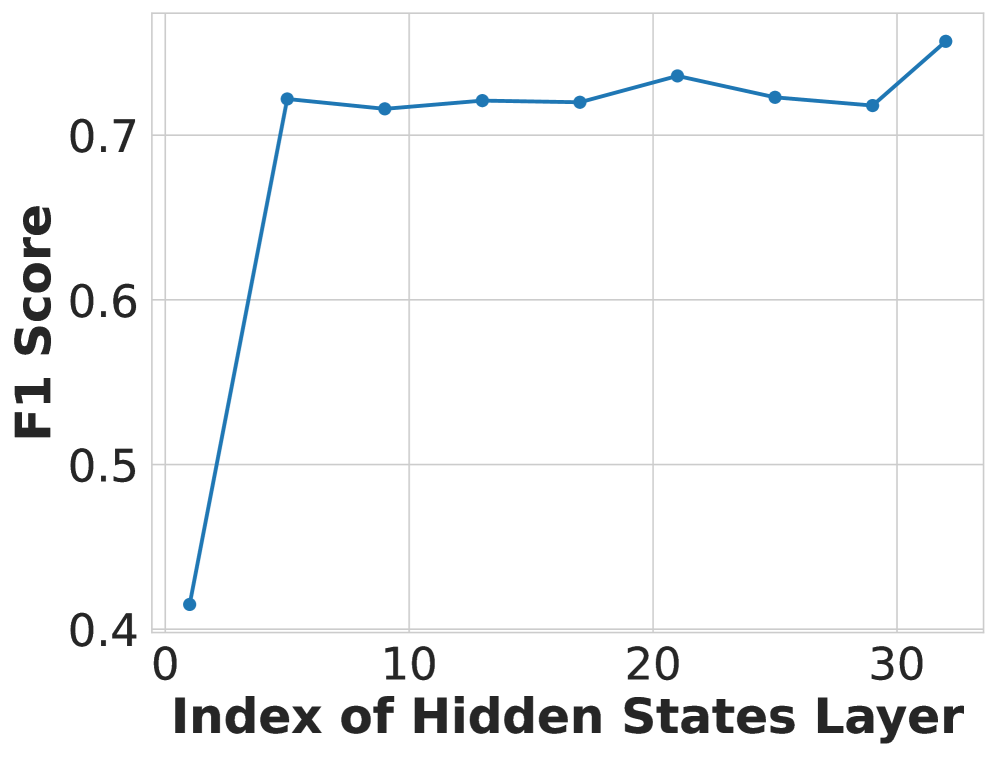

# LLaVA-Reward

## 📌 核心贡献

> 提出基于多模态大语言模型的定制化奖励模型 LLaVA-Reward，通过 Skip-connection Cross Attention (SkipCA) 模块增强视觉-文本双向交互，直接利用 MLLM 隐状态进行高效的文本到图像生成评估。

## 📖 摘要

We introduce LLaVA-Reward, an efficient reward model designed to automatically evaluate text-to-image (T2I) generations across multiple perspectives, leveraging pretrained multimodal large language models (MLLMs). Existing MLLM-based approaches require instruction-following data for supervised fine-tuning and evaluate generation quality on analyzing text response, which is time-consuming and difficult to train. To address this problem, we propose LLaVA-Reward, which directly utilizes the hidden states of MLLMs given text-image pairs. To enhance the bidirectional interaction between visual and textual representations in decoder-only MLLMs, we further propose adding a Skip-connection Cross Attention (SkipCA) module. This design enhances text-image correlation reasoning by connecting early-layer visual features with later-layer hidden representations. In addition, LLaVA-Reward supports different types of preference data for efficient fine-tuning, including paired preference data and unpaired data. We train LLaVA-Reward on four evaluation perspectives: text-image alignment, fidelity/artifact, safety, and overall ranking. Empirical results demonstrate that LLaVA-Reward outperforms conventional and MLLM-based methods in generating human-aligned scores for automatic evaluations and inference-time scaling in text-to-image generations.

## 🔍 关键信息

| 字段 | 内容 |
|------|------|
| 机构 | University at Buffalo, Adobe Research, Penn State, Luma AI |
| 发表 | 2025-07-28 (ICCV 2025) |
| 分类 | cs.CV, cs.AI, cs.CL |
| 链接 | [arXiv](https://arxiv.org/abs/2507.21391) |

## 📝 我的笔记

### 方法总览

### 动机与问题定义

现有基于 MLLM 的 T2I 评估方法存在两个核心问题：
1. 需要大量指令遵循数据进行 SFT，训练成本高
2. 通过分析文本响应评估生成质量，推理速度慢

LLaVA-Reward 直接利用 MLLM 的隐状态，绕过文本生成过程，实现高效评估。

### 方法细节

**架构设计：**
- 基础模型：Phi-3.5-vision (4.2B)
- 冻结视觉编码器和语言模型，仅训练视觉投影器和 LoRA 适配器（额外 8% 参数）
- 核心创新：SkipCA 模块作为奖励头

**SkipCA 模块：**
连接视觉投影器的投影视觉 token $\mathbf{e}_v$ 与最终隐状态 $\mathbf{e}_h$，增强 decoder-only MLLM 中视觉和文本 token 的双向感知能力。

**训练损失：**
- 配对偏好数据：Bradley-Terry 排序损失
- 非配对二元标注数据：交叉熵损失

**评估维度：** 文本-图像对齐、保真度/伪影、安全性、总体排名

**训练配置：** batch size 8，梯度累积 4，学习率 2e-4，单 epoch，4x NVIDIA A6000

### 关键实验结果

| 基准 | 指标 | LLaVA-Reward | 最佳基线 |
|------|------|-------------|---------|
| MJ-Bench 对齐 | Acc (w/o tie) | 66.2% | - |
| MJ-Bench 安全 | Acc (w/o tie) | 92.1% | - |
| MJ-Bench 伪影 | Acc (w/o tie) | 91.2% | - |
| TIFA 160 | Pearson | 71.1 | - |
| UnsafeDiff | F1 | 87.2 | - |
| 推理速度 | sec/eval | 0.35 | - |

### Ablation 分析

### 总结

LLaVA-Reward 通过直接利用隐状态+SkipCA 的设计，在保持高精度的同时大幅提升推理效率（0.35s/eval），且支持配对和非配对两种偏好数据格式，训练灵活性强。

## 🔗 相关论文

**基于/改进自：** [[LLaVA-Critic]]

**同方向：** [[HPSv3]], [[ImageReward]], [[PickScore]]
