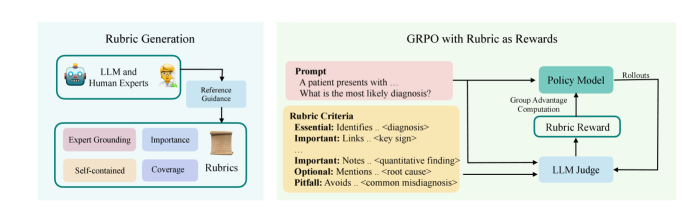
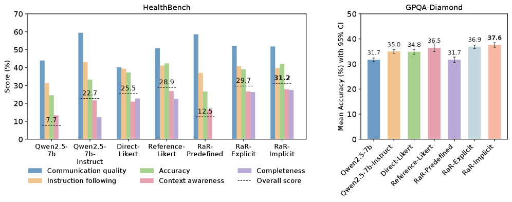
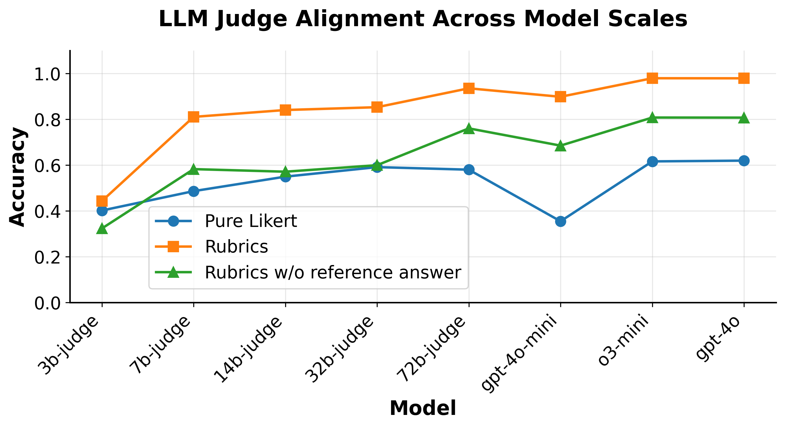

# RaR

## 📌 核心贡献

> 提出将 instance-specific rubric（评分标准）作为 reward signal 用于 on-policy RL 训练，将 RLVR 从可验证领域（数学/代码）扩展到需要主观判断的领域（医学/科学），在 HealthBench 上相对提升 31%。

## 📖 摘要

The research addresses a limitation in reinforcement learning with verifiable rewards, which works well for tasks with clear correctness (like math or coding) but struggles with subjective evaluation. The authors introduce "Rubrics as Rewards" (RaR), a method that uses rubric-based feedback to enable on-policy reinforcement learning in domains requiring nuanced judgment. The approach leverages instance-specific rubrics that capture multi-criteria evaluations rather than binary correctness signals. Performance improvements relative to LLM-as-judge baselines: HealthBench up to 31% improvement, GPQA-Diamond up to 7% improvement.

## 🔍 关键信息

| 字段 | 内容 |
|------|------|
| 机构 | Meta |
| 发表 | 2025-07-23 |
| 分类 | cs.LG, cs.AI, cs.CL |
| 链接 | [arXiv](https://arxiv.org/abs/2507.17746) |

## 📝 我的笔记

### 方法总览

### 核心问题/动机

RLVR（Reinforcement Learning with Verifiable Rewards）在可验证领域（数学、代码）效果好，因为有 binary correctness signal。但现实世界的推理任务（医学、科学）缺乏简单的可验证答案，需要**多维度、主观的判断**。传统 preference-based RM 容易 overfit 表面特征，且需要大量 pairwise 比较数据。

RaR 的定位：介于 binary correctness（RLVR）和 preference ranking（RLHF）之间的中间方案。

### 方法

#### 1. Rubric 生成

对每个 prompt 生成 instance-specific rubric，包含 7-20 个自包含的评估项，每项有分类权重：

| 权重类别 | 值 |
|---------|-----|
| Essential | 1.0 |
| Important | 0.7 |
| Optional | 0.3 |
| Pitfall | 0.9 |

四个设计原则：
1. **Grounded in Expert Guidance**：基于参考答案或专家知识
2. **Comprehensive Coverage**：覆盖事实准确性、逻辑连贯性、完整性、安全性
3. **Criterion Importance**：关键 vs 次要项的权重分级
4. **Self-Contained**：每项可独立评估，无需外部上下文

用强 LLM（GPT-4o, o3-mini）根据参考答案生成 rubric。

#### 2. Reward 聚合策略

**Explicit Aggregation（显式加权求和）**：

$$r(x, \hat{y}) = \frac{\sum_{j=1}^{k} w_j \cdot c_j(x, \hat{y})}{\sum_{j=1}^{k} w_j}$$

每个 criterion 由 LLM judge 独立评估为 0/1，最终加权归一化。

**Implicit Aggregation（隐式整体评分）**：

$$r_{\text{implicit}}(x, \hat{y}) = f_\phi(x, \hat{y}, \{d_j\}_{j=1}^{k})$$

将所有 rubric 项和权重传给 LLM judge，输出 1-10 Likert 分数（归一化到 [0,1]）。将聚合委托给模型，避免手动调权。

#### 3. 训练过程（GRPO）

- 基座：Qwen2.5-7B
- 每个 prompt 采样 k=16 个 response
- 用 gpt-4o-mini 作为 judge 计算 reward
- 训练 300 步，8xH100

#### 4. RLVR 作为特例

RaR 将 RLVR 统一为特例：当 rubric 只有一个 criterion 且为 binary 时，退化为标准 RLVR。

### 关键结果

| 方法 | HealthBench Overall | GPQA-Diamond |
|------|-------------------|--------------|
| Direct-Likert | ~25.3% | baseline |
| Reference-Likert | ~30% | — |
| RaR-Predefined | ~32% | — |
| RaR-Explicit | ~34% | — |
| **RaR-Implicit** | **~35.9%** | **+7%** |

**Judge Alignment 关键发现**：
- Rubric 结构对小 judge 模型帮助最大（Qwen-7B: 22% → 26.7%）
- 帮助小模型缩小与大模型的性能差距

### Ablation

| 消融项 | HealthBench |
|--------|-------------|
| 有参考答案的合成 rubric | 35.9% |
| 无参考答案的合成 rubric | 32.0% |
| 人工撰写 rubric | 34.8% |
| GPT-4o 生成（无参考） | 34.2% |
| 固定通用 rubric (Predefined) | ~32% |

### 总结

RaR 的核心价值在于将 rubric 作为结构化的中间表示，弥合了 binary verification 和 open-ended preference 之间的鸿沟。Implicit aggregation 优于 explicit，说明让 LLM 整体判断比逐项加权更有效。该框架天然支持多维度、可解释的 reward design，对 reward model 设计范式有启发意义。

与视觉生成 RM 的联系：rubric-based reward 的思路可迁移到视觉质量评估，将模糊的偏好判断分解为多个可评估的子维度。

## 🔗 相关论文

**基于/改进自：** —

**同方向（reward model）：** [[R3]], [[RM-R1]], [[RRM]], [[J1]], [[Checklists]], [[Rubric-ARM]], [[RRD]], [[RuscaRL]], [[AdvancedIF]]
