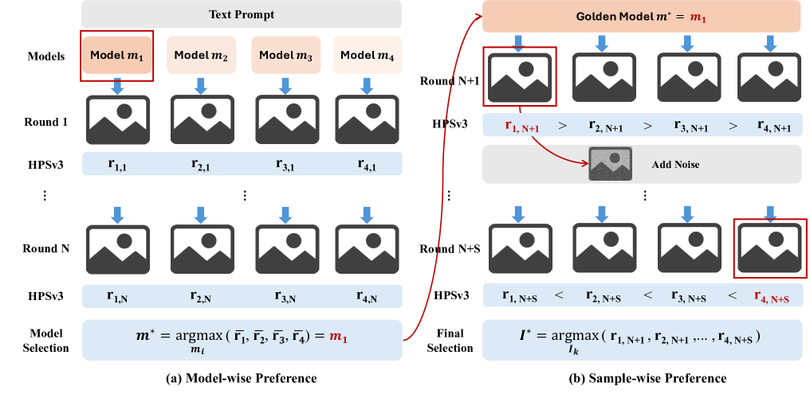
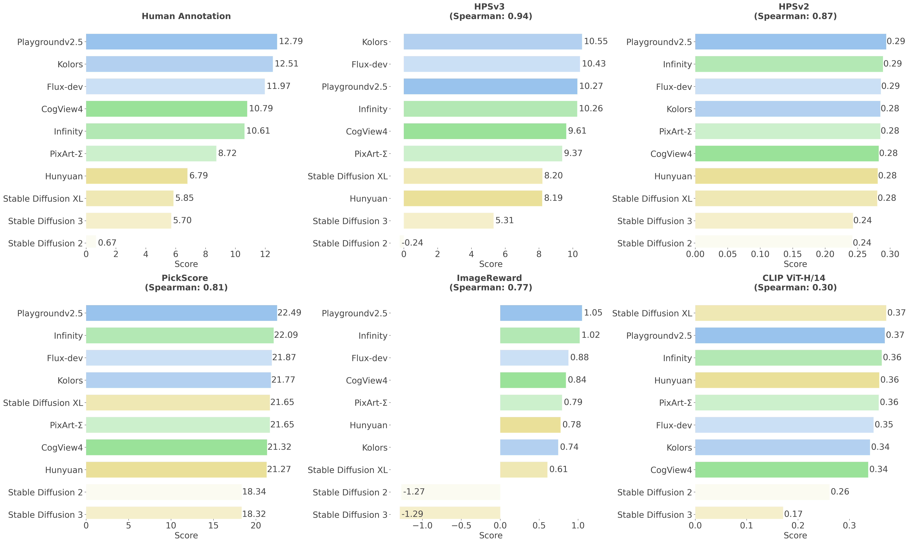
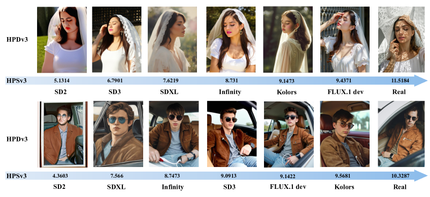

# HPSv3

## 📌 核心贡献

> 提出基于 VLM (Qwen2VL-7B) 的宽谱人类偏好评分模型 HPSv3，发布首个宽谱偏好数据集 HPDv3（1.08M 图文对、1.17M 标注），引入不确定性感知排序损失和 Chain-of-Human-Preference (CoHP) 迭代优化方法，在跨数据集泛化和人类对齐上大幅超越前代。

## 📖 摘要

Evaluating text-to-image generation through human perception alignment remains a key challenge for T2I. In this work, we release HPDv3, the first wide-spectrum human preference dataset integrating 1.08M text-image pairs and 1.17M annotated pairwise comparisons spanning diverse generation models, resolutions, and content categories. Building upon this data, we develop HPSv3, a vision-language-model-based preference model trained with specialized ranking techniques that achieves strong alignment with human judgment across various T2I paradigms. We further propose Chain-of-Human-Preference (CoHP), an iterative image refinement method that enhances generation quality without requiring additional training data, demonstrating that HPSv3 can serve as an effective optimization signal for production T2I systems.

## 🔍 关键信息

| 字段 | 内容 |
|------|------|
| 机构 | CUHK MMLab & Shanghai AI Lab & Mizzen AI |
| 发表 | 2025-08-05 |
| 分类 | cs.CV |
| 链接 | [arXiv](https://arxiv.org/abs/2508.03789) |

## 📝 我的笔记

### 方法总览

### 核心问题/动机

HPSv2 基于 CLIP，存在两个核心局限：
1. **模型能力天花板**：CLIP 的视觉-文本对齐能力有限，难以捕捉细粒度偏好差异
2. **数据覆盖不足**：HPDv2 仅覆盖有限的生成模型和分辨率范围，泛化性差

HPSv3 从模型和数据两个维度同时升级，用 VLM 替代 CLIP 作为 backbone。

### 方法

#### 1. HPDv3 宽谱偏好数据集

| 数据源 | 规模 |
|--------|------|
| HPDv3 自有标注 | 652K pairs |
| HPDv2 golden set | 250K pairs |
| Pick-A-Pic | 350K pairs |
| ImageReward | 120K pairs |
| Midjourney | 150K pairs |
| **总计** | **~1.5M pairwise samples** |

覆盖多种生成模型（SDXL、FLUX、Midjourney 等）和分辨率。

#### 2. 模型架构

- **Backbone**: Qwen2VL-7B（全参数可训练）
- **输出头**: MLP layer 从提取的特征映射到最终分数
- 输入：图像 resize 到 448×448

#### 3. 不确定性感知排序损失

关键创新：将输出分数建模为**高斯分布**而非确定性标量：

$$r \sim \mathcal{N}(\mu, \sigma)$$

通过负对数似然优化 pairwise preference：

$$\mathcal{L} = -\log P(r_w > r_l) = -\log \Phi\left(\frac{\mu_w - \mu_l}{\sqrt{\sigma_w^2 + \sigma_l^2}}\right)$$

这样模型可以表达对自身评估的不确定性，对边界案例更鲁棒。

#### 4. Chain-of-Human-Preference (CoHP)

一种迭代图像精修方法：
1. 用 HPSv3 评估当前图像
2. 基于评分信号引导图像生成模型迭代优化
3. 无需额外训练数据即可提升生成质量

训练设置：2 epochs，48×A800，学习率 $2 \times 10^{-6}$，batch size 384。

### 关键结果

| 指标 | HPSv3 | HPSv2 | PickScore |
|------|-------|-------|-----------|
| Spearman | **0.94** | 0.87 | 0.81 |
| Kendall | **0.82** | 0.76 | 0.63 |
| NMSE | **0.029** | 0.038 | 0.042 |

**跨数据集准确率**：

| 测试集 | HPSv3 |
|--------|-------|
| HPDv3 | 76.9% |
| HPDv2 | 85.4% |
| PickScore | 72.8% |

**CoHP 人类评估**: HPSv3 引导的迭代优化对比 ImageReward 取得 **87% win rate**。

### 总结

HPSv3 代表了偏好评分模型从 CLIP 时代向 VLM 时代的跃迁。用 Qwen2VL-7B 替代 CLIP 带来了显著的能力提升，而不确定性感知排序损失是一个优雅的设计——让模型不仅给出分数，还能表达置信度。HPDv3 的宽谱覆盖也为社区提供了重要的基准资源。

值得关注的是 CoHP 方法：无需额外训练数据、仅用评分信号就能迭代提升生成质量，这与 inference-time scaling 的思路一脉相承。

## 🔗 相关论文

**基于/改进自：** [[HPSv2]]

**同方向：** [[PickScore]], [[ImageReward]], [[UnifiedReward]]
