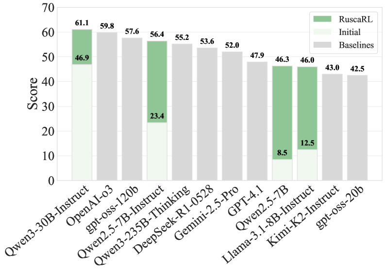
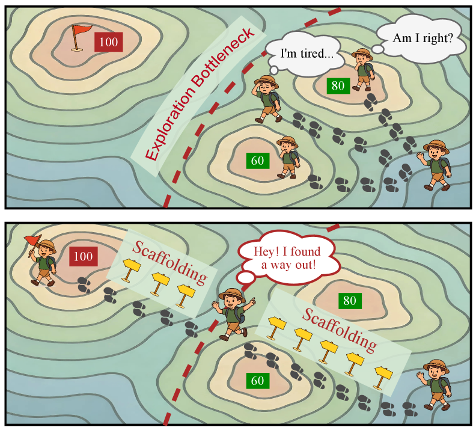
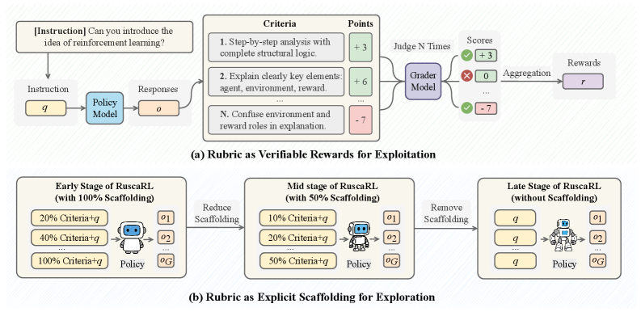

# RuscaRL

## 📌 核心贡献

> 提出 Rubric-Scaffolded RL（RuscaRL），利用 rubric 作为教学脚手架（scaffolding）打破 LLM RL 训练中的探索瓶颈，通过组内差异化和步间衰减两种机制控制脚手架强度，在 HealthBench-500 上 Qwen2.5-7B 提升 33 个绝对点。

## 📖 摘要

Recent advances in Large Language Models (LLMs) have underscored the potential of Reinforcement Learning (RL) to facilitate the emergence of reasoning capabilities. Despite the encouraging results, a fundamental dilemma persists as RL improvement relies on learning from high-quality samples, yet the exploration for such samples remains bounded by the inherent limitations of LLMs. This, in effect, creates an undesirable cycle in which what cannot be explored cannot be learned. In this work, we propose Rubric-Scaffolded Reinforcement Learning (RuscaRL), a novel instructional scaffolding framework designed to break the exploration bottleneck for general LLM reasoning.

## 🔍 关键信息

| 字段 | 内容 |
|------|------|
| 机构 | Zhejiang University, Li Auto, NTU, CUHK, Hangzhou City University |
| 发表 | 2025-08-23 |
| 分类 | cs.LG, cs.AI |
| 链接 | [arXiv](https://arxiv.org/abs/2508.16949) |

## 📝 我的笔记

### 方法总览

### 核心问题/动机

LLM RL 训练面临**探索瓶颈**（Exploration Bottleneck）：
- RL 需要从高质量样本中学习
- 但发现高质量样本受限于模型当前能力
- 形成恶性循环："探索不到的就学不到"

这在开放式任务（医学咨询、创意写作等缺乏唯一正确答案的场景）中尤为严重。

RuscaRL 的核心思路借鉴教育学中的**脚手架理论**（Scaffolding）：在学习初期提供结构化指导（rubric），随着能力提升逐步撤除。

### 方法

#### 1. Rubric-Based 评估系统

Rubric $\mathcal{R} = \{c_1, c_2, \ldots, c_N\}$，每项有分值 $p_i$。LLM grader 二值评估每项是否满足，产生向量 $\mathbf{b}$：

$$\mathbf{s} = \mathbf{b} \odot \mathbf{p}$$

归一化 reward：

$$S = \frac{\sum_{i=1}^{N} s_i}{S_{\text{total}}}$$

输出 $[0, 1]$ 范围的分数，直接用作 RL reward。

#### 2. 脚手架机制（双维度控制）

**组内差异化（Intra-Group Differentiation）**：每组 $G$ 个采样中，第 $i$ 个样本的脚手架强度为：

$$\lambda_i = \frac{G - i}{G - 1}$$

确保同一 prompt 的不同 rollout 获得不同程度的 rubric 提示，促进多样性。

**步间衰减（Inter-Step Decay）**：随训练进程 $t \in (0, 1)$ 通过 sigmoid 衰减：

$$\lambda_{\text{step}}(t) = \frac{1}{1 + e^{\alpha(t - t_0)}}$$

**综合脚手架强度**：

$$\lambda_s = \lambda_{\text{step}}(t) \times \lambda_{\text{group}}$$

#### 3. 关键设计：log probability 计算不包含脚手架

训练时使用 $\pi_\theta(o_{i,t} | q, o_{i,<t})$ 而非 $\pi_\theta(o_{i,t} | q, \mathcal{R}_s, o_{i,<t})$ 计算 log probability，鼓励模型逐步内化 rubric 中的知识而非依赖外部提示。

#### 4. GRPO 训练

标准 GRPO 目标：

$$\max \min(\rho_{i,t}(\theta) \hat{A}_i, \text{clip}(\rho_{i,t}(\theta), 1-\epsilon, 1+\epsilon) \hat{A}_i)$$

Group-relative advantage：

$$\hat{A}_i = \frac{r_i - \text{mean}(\{r_j\})}{\text{std}(\{r_j\})}$$

### 关键结果

#### 主实验

| 模型 | HealthBench-500 | WritingBench | IFEval |
|------|----------------|--------------|--------|
| Qwen3-30B-A3B (base → RuscaRL) | 46.9 → **61.1** (+14.2) | 78.1 → **79.2** (+1.1) | 83.0 → **84.5** (+1.5) |
| Qwen2.5-7B (base → RuscaRL) | 23.4 → **56.4** (+33.0) | 45.2 → **56.1** (+10.9) | 71.0 → **75.3** (+4.3) |
| Llama-3.1-8B (base → RuscaRL) | 12.5 → **46.0** (+33.5) | 36.7 → **52.7** (+16.0) | 72.6 → **79.7** (+7.1) |

#### 与基线对比（Qwen2.5-7B, HealthBench）

| 方法 | HealthBench |
|------|-------------|
| Rubric-based RL | 52.0 |
| MeRF | 36.8 |
| RL-Plus | 53.6 |
| **RuscaRL** | **56.4** |

### 训练动态分析

**策略熵分析**是关键发现：
- RuscaRL 的熵先升后降——初期脚手架促进探索（熵上升），后期衰减后转向利用（熵下降）
- 普通 Rubric-based RL 熵持续下降，说明探索能力受限

### 总结

RuscaRL 的核心贡献在于将 rubric 从**评估工具**扩展为**探索辅助工具**。脚手架机制的双维度控制（组内差异化 + 步间衰减）既保证探索多样性，又实现平滑过渡。log probability 不含脚手架的设计尤为巧妙——确保模型最终能脱离 rubric 独立推理。

HealthBench 上 +33 的绝对提升（Qwen2.5-7B）令人印象深刻，但需注意该模型的基线本身较低（23.4%），提升空间大。对于已有较强基线的模型（Qwen3-30B: 46.9%），提升收窄至 +14.2。

## 🔗 相关论文

**基于/改进自：** [[RaR]]

**同方向：** [[Rubric-ARM]], [[RRD]], [[Checklists]]
