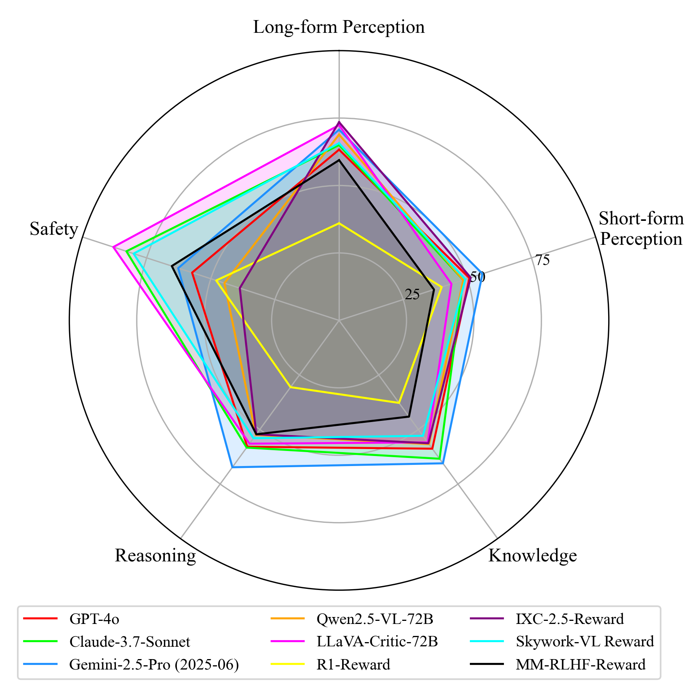
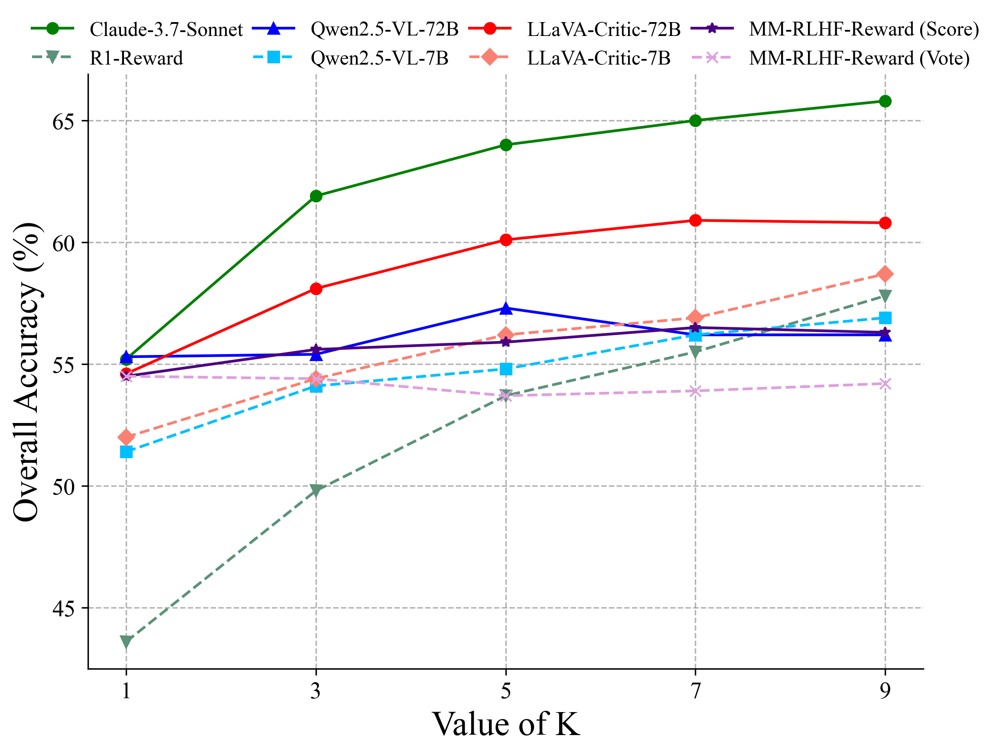
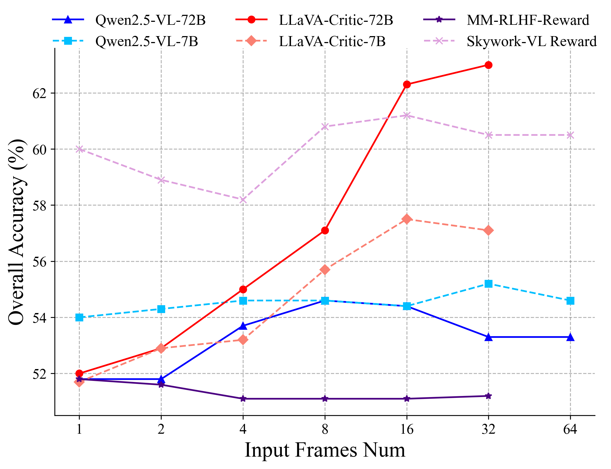

# VideoRewardBench

## 📌 核心贡献

> 提出首个覆盖感知、知识、推理和安全四大维度的视频奖励模型综合基准 VideoRewardBench，包含 1,563 个高质量偏好对，系统评估了 28 个多模态奖励模型，揭示即使最强模型 GPT-4o 整体准确率仅 57.0%，并发现 RL 训练不一定带来更强的跨模态泛化能力。

## 📖 摘要

Multimodal reward models (MRMs) play a crucial role in the training, inference, and evaluation of Large Vision Language Models (LVLMs) by assessing response quality. However, existing benchmarks for evaluating MRMs in the video domain suffer from a limited number and diversity of questions, a lack of comprehensive evaluation dimensions, and inadequate evaluation of diverse types of MRMs. To address these gaps, we introduce VideoRewardBench, the first comprehensive benchmark covering four core aspects of video understanding: perception, knowledge, reasoning, and safety. Through our AI-assisted data pipeline, we curate a high-quality preference dataset of 1,563 annotated samples, including 1,482 unique videos and 1,559 distinct questions--15 times the number found in the most question-rich prior benchmark. Each sample is a triplet consisting of a video-text prompt, a chosen response, and a rejected response. We also conduct a comprehensive evaluation across 28 multimodal reward models spanning three categories: generative, discriminative, and semi-scalar. Results show that even the top-performing model GPT-4o achieves only 57.0% overall accuracy, and the state-of-the-art open-source model Qwen2.5-VL-72B reaches merely 53.3%. Our analysis further reveals three key insights: (i) MRMs trained with reinforcement learning (RL) do not necessarily exhibit stronger cross-modal generalization than those trained without RL; (ii) except for discriminative MRMs, other types of MRMs across varying model capacities can benefit from inference-time scaling; and (iii) variations in input video frame count have different effects on different types of MRMs. We believe VideoRewardBench offers a challenging and valuable benchmark for advancing the evaluation and development of MRMs in the video domain.

## 🔍 关键信息

| 字段 | 内容 |
|------|------|
| 机构 | University of Science and Technology of China / Huawei Noah's Ark Lab |
| 发表 | 2025-08-30 |
| 分类 | cs.CV, cs.AI |
| 链接 | [arXiv](https://arxiv.org/abs/2509.00484) |

## 📝 我的笔记

### 动机与问题定义

现有视频领域多模态奖励模型（MRM）评估基准存在三大缺陷：

1. **问题数量和多样性有限**：现有基准的问题数量少，难以全面评估
2. **评估维度不全面**：缺乏对感知、知识、推理、安全等多维度的系统覆盖
3. **MRM 类型覆盖不足**：未对生成式、判别式、半标量式等不同类型的 MRM 进行充分分析

VideoRewardBench 是首个专门面向视频理解的综合性奖励模型基准。

### 方法总览

#### 基准构建流程

基准构建分为三个阶段：

**阶段一：Prompt 收集**
- 从 10 个已有视频基准（VCGBench-Diverse, MVBench, VideoHallucer, MMWorld, MMVU, Video-MMMU, Video-MME, MMBench-Video, VSI-Bench, Video-SafetyBench）中收集数据
- 多阶段过滤：移除超过 10 分钟的视频；过滤不需要视频输入即可回答的问题；移除 Qwen2-VL-7B-Instruct 能正确回答的样本（确保难度）

**阶段二：Response 收集**
- 长文本感知：5 个模型生成回答，3 名标注者多数投票判定
- 短文本感知：Ground-truth 作为 chosen，错误选项作为 rejected
- 知识与推理：每个 prompt 由专有模型生成 10 个回答，过滤过易/过难问题，人工验证推理正确性
- 安全：6 个模型生成回答，用 RJScore 指标分类，仅保留攻击成功率 >50% 的 prompt

**阶段三：偏好标注**
- 人工标注偏好对，验证标注者间一致性
- 评估偏好强度（值越高表示回答区分度越大）

#### 评估维度

| 维度 | 子维度 | 样本数 | 数据来源 |
|------|--------|--------|----------|
| Perception | Long-form | 283 | VCGBench-Diverse |
| Perception | Short-form | 413 | MVBench, VideoHallucer |
| Knowledge | - | 238 | MMWorld, MMVU, Video-MMMU |
| Reasoning | - | 278 | Video-MME, MMBench-Video, VSI-Bench |
| Safety | - | 351 | Video-SafetyBench |

#### 数据集统计

- **总样本数**：1,563 个偏好对，1,482 个唯一视频，1,559 个不同问题（是现有最丰富基准的 15 倍）
- **视频时长分布**：短视频（≤1min）59.9%，中等（1-5min）33.2%，长视频（>5min）6.9%
- **回答长度**：平均 103.8 词，chosen 与 rejected 回答平均长度接近（102.9 vs 104.6），长度偏差极小

长度差异计算公式：

$$\frac{l_{rejected} - l_{chosen}}{l_{chosen}} \times 100\%$$

#### 评估的模型类型

共评估 **28 个** MRM，分为三类：

- **生成式 MRM**（21 个）：包括 5 个专有模型（GPT-4o, Claude-3.7-Sonnet, Gemini-2.5-Pro 等）、11 个开源非 critic 模型、3 个快思考 critic 模型、3 个慢思考 critic 模型
- **判别式 MRM**（2 个）：IXC-2.5-Reward, Skywork-VL Reward
- **半标量式 MRM**（1 个）：MM-RLHF-Reward

### 关键结果

#### 主要性能对比（Table 4）

| 模型 | 参数量 | Long Perc. | Short Perc. | Knowledge | Reasoning | Safety | Overall |
|------|--------|-----------|------------|-----------|-----------|--------|---------|
| **专有模型** | | | | | | | |
| Gemini-2.5-Pro | - | 70.7% | 55.9% | 65.5% | 67.3% | 62.7% | **63.6%** |
| Claude-3.7-Sonnet | - | 65.0% | 48.4% | 63.4% | 58.3% | 82.9% | **63.2%** |
| GPT-4o | - | 63.3% | 50.8% | 58.8% | 57.9% | 57.3% | **57.0%** |
| GPT-4o-mini | - | 74.6% | 47.2% | 58.8% | 52.9% | 44.7% | **54.4%** |
| Gemini-2.5-flash | - | 61.8% | 53.0% | 56.7% | 49.6% | 55.0% | **55.0%** |
| **开源生成式（部分）** | | | | | | | |
| InternVL3-78B | 78B | 70.0% | 49.2% | 57.1% | 50.0% | 65.8% | **58.0%** |
| LLaVA-Video-72B | 72B | 68.6% | 41.2% | 61.8% | 58.6% | 70.4% | **58.9%** |
| Qwen2.5-VL-72B | 72B | 68.9% | 48.4% | 56.7% | 52.5% | 44.7% | **53.3%** |
| Qwen2.5-VL-7B | 7B | 56.2% | 37.5% | 53.8% | 46.8% | 80.1% | **54.6%** |
| **Critic 训练模型** | | | | | | | |
| LLaVA-Critic-72B | 72B | 72.4% | 43.8% | 55.9% | 56.5% | 88.0% | **63.0%** |
| LLaVA-Critic-7B | 7B | 68.2% | 46.5% | 50.0% | 42.1% | 77.5% | **57.1%** |
| UnifiedReward | 7B | 67.1% | 48.2% | 50.4% | 45.3% | 71.2% | **56.6%** |
| UnifiedReward-Think | 7B | 59.7% | 53.3% | 50.0% | 52.9% | 55.6% | **54.4%** |
| R1-Reward | 7B | 36.0% | 40.0% | 37.8% | 30.6% | 47.9% | **39.0%** |
| Flex-Judge | 7B | 35.0% | 35.1% | 37.0% | 37.1% | 30.2% | **34.6%** |
| **判别式** | | | | | | | |
| Skywork-VL Reward | 7B | 65.7% | 49.2% | 52.9% | 54.0% | 80.1% | **60.5%** |
| IXC-2.5-Reward | 7B | 73.5% | 51.3% | 56.3% | 52.2% | 38.7% | **53.4%** |
| **半标量式** | | | | | | | |
| MM-RLHF-Reward | 7B | 59.4% | 37.0% | 44.1% | 52.2% | 65.2% | **51.2%** |

### 三大核心发现

#### 发现一：RL 训练不一定带来更强的跨模态泛化

经 RL 训练的 MRM 在视频理解任务上并不必然优于非 RL 训练的模型。快思考 SFT 训练的模型（如 LLaVA-Critic-72B，63.0%）甚至优于慢思考 RL 训练的变体（如 R1-Reward，39.0%；Flex-Judge，34.6%）。

#### 发现二：推理时缩放（Inference-time Scaling）

- 生成式和半标量式 MRM 可从多次采样中获益
- Claude-3.7-Sonnet 在 K 从 1 增到 9 时提升 10.6%
- Qwen2.5-VL-72B 在 K=5 时仅提升 0.9%
- 判别式 MRM 不受推理时缩放影响
- 温度设置关键：1.0 对大多数模型最有效

#### 发现三：输入帧数的差异化影响

- Critic 训练的生成式 MRM 明显受益于更多帧：LLaVA-Critic-72B 从 52.0%（1帧）提升到 63.0%（64帧）
- 非 critic 训练模型的帧数效应不显著
- 半标量式 MRM 受帧数影响最小
- Qwen2.5-VL 在安全维度上帧数增加反而导致性能下降

### 总结性评价

VideoRewardBench 是视频领域 MRM 评估的重要里程碑，填补了此前缺乏综合性视频奖励模型基准的空白。几个值得关注的点：

1. **基准设计合理**：从 10 个现有数据集收集，覆盖五大子维度，且通过多阶段过滤确保难度和质量
2. **规模优势明显**：1,563 个偏好对，是此前最丰富基准的 15 倍
3. **挑战性强**：最强模型仅 63.6%，说明视频理解的奖励建模仍有巨大改进空间
4. **发现有价值**：RL 训练不一定带来跨模态泛化优势这一发现，对未来视频 RM 的训练策略选择有重要参考意义
5. **安全维度的独特性**：Claude-3.7-Sonnet 在安全维度表现突出（82.9%），而一些开源模型如 Qwen2.5-VL-72B 在安全维度仅 44.7%，反映了不同模型在安全对齐方面的显著差异

## 🔗 相关论文

**基于/改进自：** [[LLaVA-Critic]], [[UnifiedReward]], [[UnifiedReward-Think]]

**同方向：** [[VBench]], [[RewardBench2]], [[MMRB2]]
