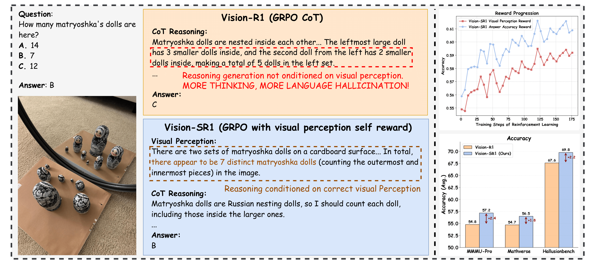
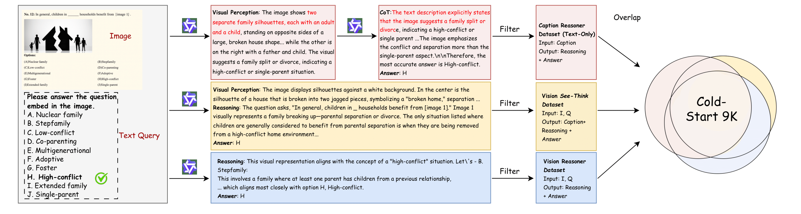

# Vision-SR1

## 📌 核心贡献

> 提出 Vision-SR1，通过将推理分解为视觉感知和语言推理两个阶段实现自奖励，无需外部奖励模型即可减轻视觉幻觉并增强视觉-语言模型的感知与推理能力。

## 📖 摘要

The paper addresses visual hallucinations and language shortcuts in Vision-Language Models by introducing Vision-SR1, a self-rewarding approach. The method decomposes reasoning into visual perception generation followed by language reasoning. Rather than relying on external supervision, it prompts the model to generate self-contained visual descriptions, then validates these descriptions through language reasoning using only the generated perception. This self-reward signal, combined with output supervision, strengthens both visual perception and language reasoning while mitigating hallucinations across diverse vision-language tasks.

## 🔍 关键信息

| 字段 | 内容 |
|------|------|
| 机构 | Tencent AI Lab, University of Maryland, WUSTL |
| 发表 | 2025-08-27 |
| 分类 | cs.CV |
| 链接 | [arXiv](https://arxiv.org/abs/2508.19652) |

## 📝 我的笔记

### 方法总览

### 动机与问题定义

VLM 存在两个关键问题：
1. **视觉幻觉**：模型生成与图像内容不符的描述
2. **语言捷径**：模型依赖语言先验而非真正的视觉理解来回答问题

现有方法依赖外部奖励模型来纠正这些问题，但这引入了额外的标注成本和偏差。Vision-SR1 的核心思路是通过推理分解实现自奖励。

### 方法细节

**See-Think 格式分解：**
将 VLM 推理分为两个阶段：
1. **视觉感知 (See)**：生成自包含的视觉描述
2. **语言推理 (Think)**：基于感知描述进行 CoT 推理

**双 Rollout 自奖励：**
- **第一轮**：(Image, Query) -> (Visual Perception, CoT Reasoning, Answer)
- **第二轮**：(Query, Visual Perception) -> (CoT Reasoning, Answer)，去掉图像输入

**总奖励函数：**

$$r(Q,s) = r_{visual}(Q,c) + r_{ans}(Q,a) + \alpha \cdot r_{fmt}(s)$$

核心思想：如果模型生成的视觉感知描述足够准确和完整，那么即使不给图像，仅靠该描述也能正确回答问题。这个「自包含性」作为视觉感知质量的自奖励信号。

**训练流程：**
- SFT 冷启动：9K 格式化样本
- RL 训练：1 epoch，47K 多样化视觉-语言数据集
- 基于多模态 GRPO 框架

### 关键实验结果

| 基准 | Vision-SR1 (7B) | Vision-R1 | SFT Only |
|------|----------------|-----------|----------|
| MMMU | 49.1 | 47.7 | 41.8 |
| MMMU-Pro | 57.2 | 54.8 | 51.8 |
| MM-Vet | 76.2 | 78.9 | 79.4 |
| MathVerse | 56.5 | 54.7 | 55.5 |
| **平均** | **58.8** | **57.4** | **55.1** |

**语言捷径率 (LSR, 越低越好)：** Vision-SR1 平均 6.7% vs 无自奖励 7.9%

### Ablation 分析

消融实验表明自奖励组件贡献 +1.1 平均分（58.8 vs 57.7），且在降低语言捷径率方面效果显著。

### 总结

Vision-SR1 提出了一个优雅的自奖励范式：通过检验视觉感知描述的「自包含性」来衡量感知质量。方法无需外部 RM，训练简单，在多个 VL 基准上超越 Vision-R1 等方法。

## 🔗 相关论文

**基于/改进自：** [[Self-Rewarding]]

**同方向：** [[R1-Reward]]
