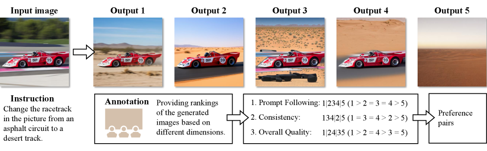
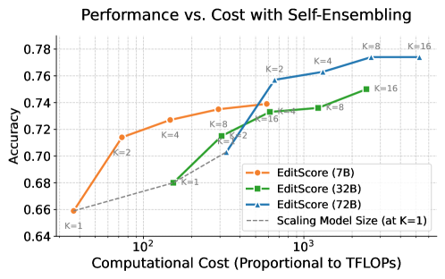
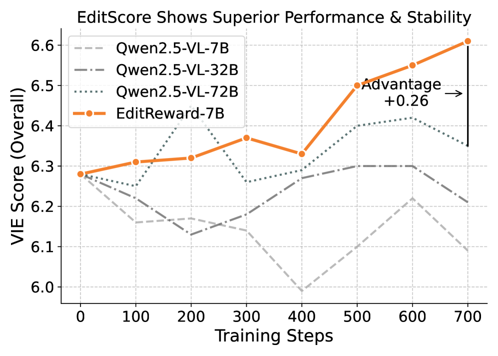

# EditScore

## 📌 核心贡献

> 提出 EditScore 系列奖励模型（7B-72B），专为图像编辑质量评估设计，通过链式思维推理和推理时集成达到甚至超越 GPT-4 的评估精度，并首次证明高保真奖励模型是解锁图像编辑在线 RL 的关键。

## 📖 摘要

Reinforcement learning (RL) has shown strong potential for aligning generative models with human preferences. However, extending online RL to instruction-guided image editing remains largely unexplored, mainly due to the lack of reliable reward signals. To address this gap, we first construct EditReward-Bench, a benchmark for evaluating reward models in the context of image editing. We then introduce EditScore, a series of reward models (7B-72B) specifically designed for assessing editing quality. Our approach matches proprietary VLM performance and surpasses GPT-4 on our benchmark. We demonstrate that a high-fidelity reward model is the key to unlocking online RL for image editing, enabling effective policy optimization where standard VLMs fail.

## 🔍 关键信息

| 字段 | 内容 |
|------|------|
| 机构 | USTC / BAAI |
| 发表 | 2025-09-28 |
| 分类 | cs.CV |
| 链接 | [arXiv](https://arxiv.org/abs/2509.23909) |

## 📝 我的笔记

### 方法总览

### 动机与问题定义

在线 RL 在图像编辑领域尚未被充分探索，主要瓶颈在于缺乏可靠的奖励信号。通用 VLM（如 GPT-4o）作为评估器存在系统性偏差，无法有效指导 RL 训练。EditScore 旨在构建专用于图像编辑的高保真奖励模型。

### 方法细节

**奖励建模方法：** 将奖励建模公式化为条件文本生成任务，基于 Qwen2.5-VL 使用 LoRA 微调。模型接受 (指令, 输入图像, 输出图像) 三元组，输出 (推理过程, 标量分数)。

**评估框架（VIEScore）：** 并行评估两个维度：
- **语义一致性（SC）**：指令遵循 + 区域保持
- **感知质量（PQ）**：真实感 + 无伪影

最终分数使用几何均值：

$$S_{\text{final}} = \sqrt{S_{SC} \cdot S_{PQ}}$$

**推理时集成：** 对 $K$ 次独立前向传播取均值：

$$S_{\text{final}}(z) = \frac{1}{K} \sum_{i=1}^{K} s_i$$

**数据构建流程：**
1. K-center 贪心算法选取 1000 张多样化样本
2. 5 个不同编辑模型生成候选输出
3. GPT-4.1 标注 + 基于分数标准差和最大值的过滤

### 关键结果

**EditReward-Bench 性能：**

| 模型 | Overall | PF | C | O |
|------|---------|------|------|------|
| GPT-4.1 | 0.673 | 0.673 | 0.602 | 0.705 |
| GPT-5 | 0.777 | 0.777 | 0.669 | 0.755 |
| EditScore-72B (Avg@4) | 0.755 | 0.755 | 0.735 | 0.763 |

**RL 训练结果（OmniGen2 Base）：**

| 奖励信号 | SC | PQ | Overall | GEdit-Bench |
|---------|------|------|---------|-------------|
| Baseline | 6.72 | 7.20 | 6.28 | 3.40 |
| RL w/ EditScore-7B (Avg@4) | 7.20 | 7.46 | 6.68 | 3.63 |

### 总结评价

EditScore 的核心价值在于证明了"高保真奖励模型是解锁图像编辑在线 RL 的关键"。通用 VLM 作为奖励模型在编辑任务上存在系统性失败，而专用训练的 EditScore 不仅在评估精度上匹配/超越 GPT-4，还能有效指导 RL 策略优化。推理时集成（Avg@4）提供了额外的精度提升，且计算成本接近线性。

## 🔗 相关论文

**同方向：** [[ImageReward]], [[FIRM]]
