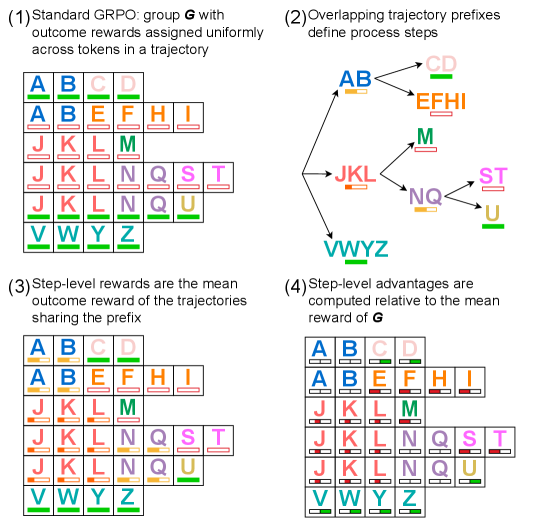
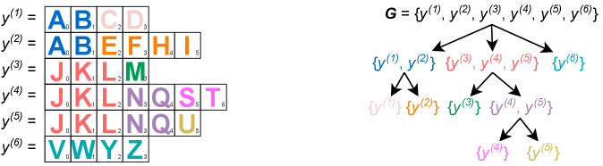
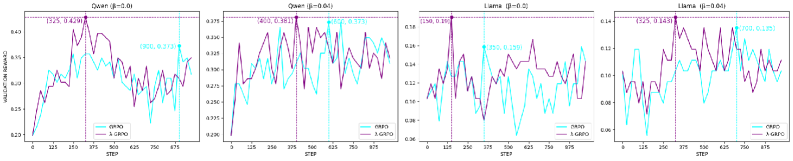

# GRPO-PRM

## 📌 核心贡献

> 从理论上证明 GRPO 使用结果奖励模型时隐式等价于一个基于蒙特卡洛的过程奖励模型，并发现其在处理不平衡过程步骤时的弱点，提出 lambda-GRPO 修正方案显著提升推理任务性能。

## 📖 摘要

The researchers demonstrate that Group Relative Policy Optimization (GRPO) with an outcome reward model functionally operates as a PRM-aware RL objective equipped with a non-trivial, Monte-Carlo-based PRM. They identify a weakness in GRPO when handling imbalanced process steps and propose lambda-GRPO as a solution. Testing shows that language models trained with the modified approach outperform LLMs tuned with standard GRPO on downstream reasoning tasks while maintaining minimal computational overhead.

## 🔍 关键信息

| 字段 | 内容 |
|------|------|
| 机构 | - |
| 发表 | 2025-09-25 |
| 分类 | cs.LG, cs.AI |
| 链接 | [arXiv](https://arxiv.org/abs/2509.21154) |

## 📝 我的笔记

### 方法总览

### 动机与问题定义

GRPO 是当前 LLM 推理对齐中最流行的 RL 算法之一。这篇工作从理论角度揭示了一个出人意料的发现：**GRPO 配合结果奖励模型 (ORM) 使用时，本质上等价于一个过程奖励模型 (PRM)**。

### 方法细节

**理论证明核心：**

GRPO 的 advantage 计算：

$$a_i = \frac{r^{(i)} - r_{mean}(\mathbb{G})}{r_{std}(\mathbb{G})}$$

当 group 内的轨迹共享相同前缀时，token 级 advantage $A_{i,t}$ 自然对应过程奖励 $R_{i,t}$。

**关键发现：**
- 99.8% 的 group（6,700/6,725）在 group size 6 时生成非平凡的 $\mathcal{B}(\mathbb{G})$ 树结构
- 训练过程中路径深度和中间节点比例持续增长

**GRPO 的弱点：** 不平衡的过程步骤频率导致偏差

**lambda-GRPO 修正：**
通过 $|\lambda^{(i,t)}|^{-1}$ 缩放 token 级损失，消除原始目标中不平衡过程步骤频率的影响。

### 关键实验结果

| 模型 | 方法 | AIME24 | MATH-500 | AMC23 | Minerva | OlympiadBench | 平均 |
|------|------|--------|----------|-------|---------|---------------|------|
| Qwen-Base | - | 0.200 | 0.830 | 0.750 | 0.298 | 0.510 | 0.518 |
| Qwen | lambda-GRPO | **0.400** | **0.834** | **0.800** | 0.298 | **0.538** | **0.574** |
| Llama-Base | - | 0.000 | 0.228 | 0.075 | 0.048 | 0.056 | 0.081 |
| Llama | lambda-GRPO | **0.033** | **0.256** | 0.075 | **0.074** | 0.049 | **0.097** |

所有 lambda-GRPO 模型在更少训练步数内达到更高验证准确率，平均提升 >10%，训练步数减少 <50%。

### 总结

这是一个理论驱动的优秀工作。核心贡献在于揭示了 GRPO 与 PRM 之间的深层联系，这一发现不仅提供了对 GRPO 成功原因的新理解，还直接导出了实用的改进方案 lambda-GRPO。代码开源：[GitHub](https://github.com/coli-saar/grpo-prm/)。

## 🔗 相关论文

**同方向：** [[PRM800K]], [[PRIME]], [[RewardOveropt]]
