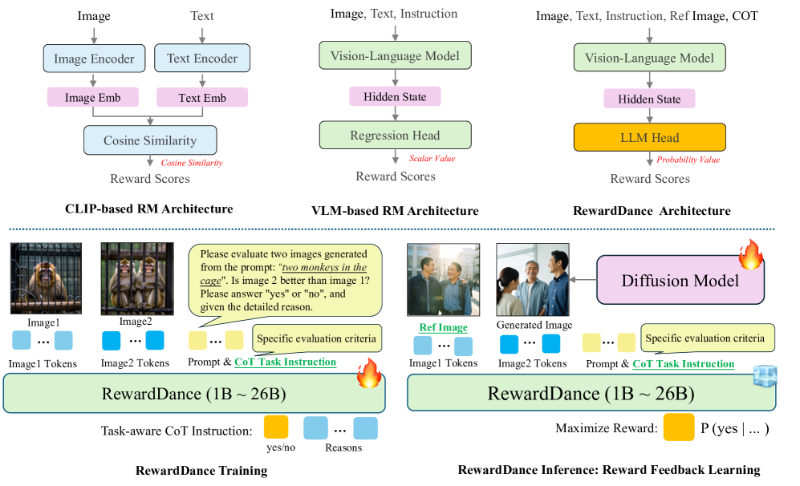
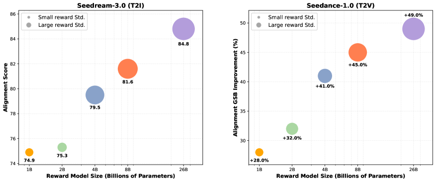
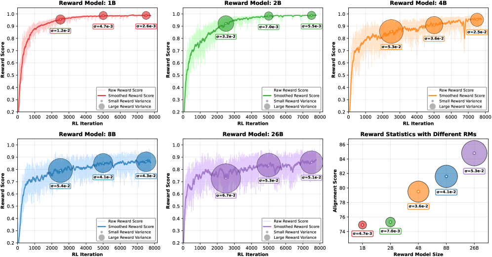

# RewardDance

## 📌 核心贡献

> 首次提出视觉生成领域的统一生成式 RM 框架，将 reward scoring 重新表述为 VLM 预测 "yes" token 的概率，与 next-token prediction 原生对齐，并通过模型规模（1B→26B）+ 上下文丰富度的双维度 scaling 实现性能提升和 reward hacking 抵抗。

## 📖 摘要

We present RewardDance, a novel framework that treats reward scoring as the model's probability of predicting a "yes" token, indicating that the generated image outperforms a reference image. This approach aligns reward mechanisms with Vision-Language Model architectures. The framework scales reward models along two dimensions: model scaling (up to 26 billion parameters) and context scaling (incorporating task-specific instructions, reference examples, and chain-of-thought reasoning). Large-scale models maintain high reward variance during training, resisting reward hacking and reducing mode collapse. RewardDance demonstrates improvements across text-to-image, text-to-video, and image-to-video generation tasks.

## 🔍 关键信息

| 字段 | 内容 |
|------|------|
| 机构 | ByteDance Seed |
| 发表 | 2025-09-10 |
| 分类 | cs.CV, cs.LG |
| 链接 | [arXiv](https://arxiv.org/abs/2509.08826) |

## 📝 我的笔记

### 方法总览

### 核心问题/动机

现有视觉生成的 Reward Model 存在根本性缺陷：
- **CLIP-based RM**：受限于双编码器架构和单模态设计，难以扩展
- **VLM-based 回归 RM**：使用 Bradley-Terry loss + 回归头，与模型原生的 next-token prediction 范式不匹配
- **Reward Hacking**：模型利用奖励信号的缺陷获取高分，而非真正提升质量，导致 mode collapse

核心洞察：**视觉生成领域的 RM scaling 范式尚未被充分探索**。

### 方法

#### 1. Generative Reward Paradigm（核心创新）

抛弃回归头，将 reward scoring 重新表述为 token 生成任务：

$$r_\theta(x_1, x_2, y, i) = P_\theta(\text{"yes"} \mid x_1, x_2, y, i)$$

- $x_1, x_2$ = 被比较的图像 tokens
- $y$ = prompt
- $i$ = task-aware instruction
- 奖励 = VLM 预测 "yes" token 的概率（即生成图像优于参考图像的概率）

这使得 reward 目标与 VLM 的自回归 next-token prediction 机制**原生对齐**。

#### 2. 两维度 Scaling

**Model Scaling**：基于 InternVL 架构，从 1B 扩展到 26B 参数。更大的 RM 在训练过程中保持**更大的 reward 方差**，表明持续探索，抵抗 reward hacking。

**Context Scaling**：丰富输入上下文：
1. **Task-aware instructions**：基于预定义标准引导评估
2. **Reference images**：通过 Best-of-N 采样策略实现图像对比较
3. **Chain-of-Thought (CoT) reasoning**：模型生成决策理由，提升可解释性和性能

#### 3. 训练变体

- **Pairwise Generative（主要）**：需要参考图像，用 Bradley-Terry loss 在偏好对上训练
- **Pointwise Generative**：仅接受 prompt + 生成图像，使用 BT loss + 加权交叉熵 loss（对 preferred samples 赋 "yes" 标签）

#### 4. Reward Feedback Alignment

- **RL Fine-tuning**：采用 ReFL 算法，Best-of-N 采样生成候选图像，pairwise 比较找到最优参考
- **Inference-Time Scaling**：Search over Paths — 初始化 N 条采样轨迹，在每个 ODE 采样步用轻量 pointwise RM 剪枝搜索空间

### 关键结果

| 任务 | 基线 | + 26B RM | 提升 |
|------|------|----------|------|
| FLUX.1-dev 图文对齐 | 67.0 | 73.6 | +6.6 |
| Seedance T2V (GSB) | baseline | +49% | 显著 |
| GenEval | SD3: 0.74 | Seedream-3.0: 0.79 | +0.05 |
| Bench-240 | Imagen 3: 0.79 | Seedream-3.0: 0.848 | +0.058 |

**关键发现**：
- OOD accuracy 比 ID accuracy 更能预测最终 RL 性能
- 26B RM 训练全程保持高方差，1B-2B RM 快速收敛
- CoT 训练带来 +2.0 对齐分提升 (81.6→83.6)

### Ablation

| 组件 | 影响 (FLUX) |
|------|------------|
| 回归→生成范式 | 70.8 → 71.6 |
| 加入参考图像 (pairwise) | 71.6 → 73.0 |
| CoT 训练 | 81.6 → 83.6 (Seedream) |

### 总结

核心贡献在于将 reward scoring 与 VLM 的 next-token prediction 原生对齐，避免范式不匹配问题。大模型（26B）天然抵抗 reward hacking，是一种 elegant 的 scaling 方案。

## 🔗 相关论文

**基于/改进自：** [[ImageReward]]

**同方向（reward model）：** [[SoliReward]]
