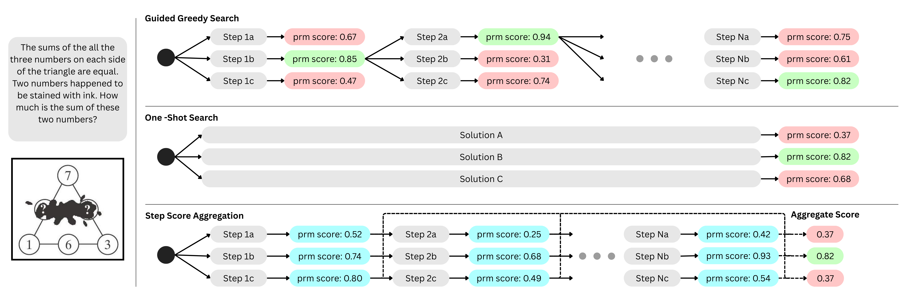
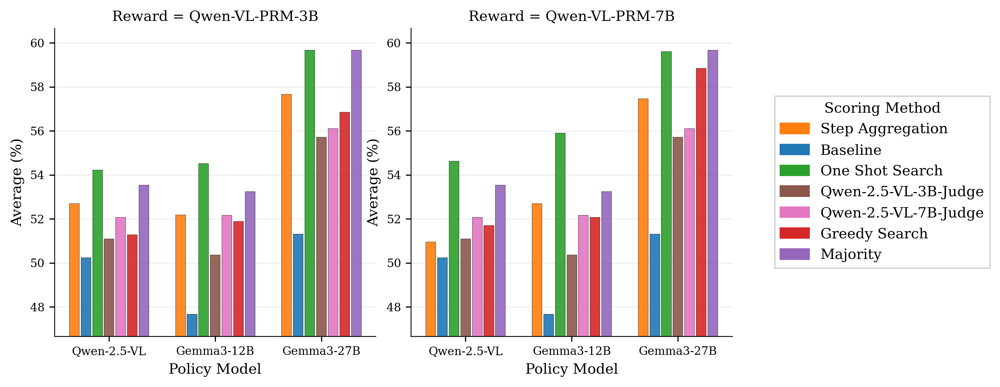

# VL-PRM

## 📌 核心贡献

> 首个系统研究视觉-语言过程奖励模型 (VL-PRM) 的工作，提出混合数据合成框架（MCTS + VLM 判断），构建 VL-PRM300K 数据集，并揭示了小模型 VL-PRM 可媲美大模型、感知级监督显著提升性能等关键洞察。

## 📖 摘要

The paper explores design strategies for Vision-Language Process Reward Models (VL-PRMs). Key contributions include: a hybrid data synthesis framework combining MCTS with VLM judgments for improved step-level labels; perception-focused supervision for detecting visual grounding errors; and systematic evaluation of test-time scaling strategies. Findings across five multimodal benchmarks reveal that VL-PRMs as outcome reward models can outperform process-step selection, smaller models can match larger ones in error detection, and perception-level supervision significantly improves performance.

## 🔍 关键信息

| 字段 | 内容 |
|------|------|
| 机构 | AI Singapore, Nanyang Technological University |
| 发表 | 2025-09-27 |
| 分类 | cs.AI, cs.CV |
| 链接 | [arXiv](https://arxiv.org/abs/2509.23250) |

## 📝 我的笔记

### 方法总览

### 动机与问题定义

PRM 在纯文本推理（如数学）中已取得显著成功，但在多模态（视觉-语言）推理场景中的应用仍缺乏系统研究。VL-PRM 面临独特挑战：
1. 需要评估视觉感知准确性（不仅是逻辑推理）
2. 缺乏大规模多模态步骤级标注数据
3. 测试时扩展策略的选择不明确

### 方法细节

**数据集 VL-PRM300K：**
- 290K 样本，覆盖 6 个数据集（RAVEN, CLEVR-Math, InfoVQA, VQAv2, AI2D, DVQA）
- 约 1.32M 步骤级标注
- 混合标注：MCTS + o4-mini 判断模型
- 结构化推理：显式区分感知和推理阶段

**模型训练：**
- 基础模型：Qwen-2.5-VL (3B, 7B)
- 输入格式：{I, q, s_0, p}（图像、问题、步骤、系统提示）
- 最小化交叉熵损失，预测每步 "+" 或 "-" token

**三种测试时扩展策略：**

1. **Guided Greedy Search**：每步采样 N 个候选
2. **One-shot Search**：对 N 个完整解打分
3. **Step-Score Aggregation**：平均步骤级概率

### 关键实验结果

| 基准 | Baseline (7B) | +VL-PRM-3B | +VL-PRM-7B |
|------|--------------|-----------|-----------|
| MMMU | 55.0% | 57.6% (+2.6) | 57.4% (+2.4) |
| PuzzleVQA | 48.0% | 55.5% (+7.5) | 54.8% (+6.8) |
| AlgoPuzzleVQA | 29.1% | 33.8% (+4.7) | 35.3% (+6.2) |
| MathVista | 67.8% | 70.0% (+2.2) | 71.0% (+3.2) |

**VisualProcessBench 错误检测 F1：**

| 模型 | F1 |
|------|-----|
| Qwen-VL-PRM-3B | 61.9 (+10.9) |
| Qwen-VL-PRM-7B | 58.6 (+7.6) |
| GPT-4o | 60.3 |

**关键洞察：** 3B VL-PRM 在错误检测上已与 GPT-4o 竞争力相当（61.9 vs 60.3）。

**PerceptionProcessBench：** 加入感知级训练后 F1 从 33.3 提升到 66.8 (3B) / 70.3 (7B)。

### 总结

这篇工作的系统性很强，三个关键发现对 VL-PRM 领域具有指导意义：(1) VL-PRM 作为 ORM 使用时反而优于过程级引导；(2) 小模型 PRM 可与大模型媲美；(3) 感知级监督是提升性能的关键。VL-PRM300K 数据集的构建方法论也值得参考。

## 🔗 相关论文

**基于/改进自：** [[VisualPRM]]

**同方向：** [[PRM800K]], [[R1-Reward]]
