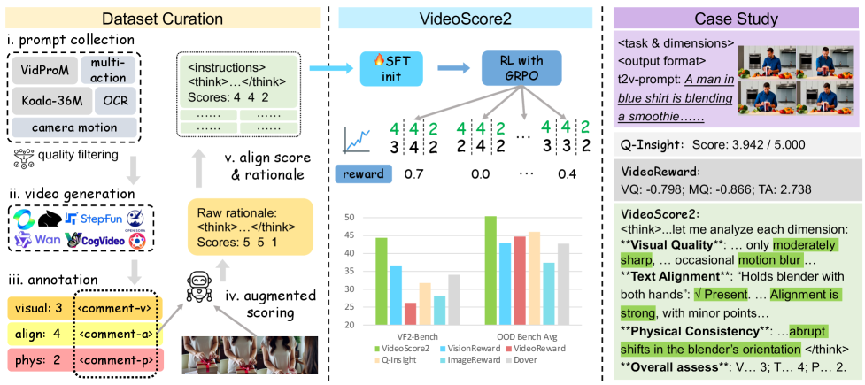
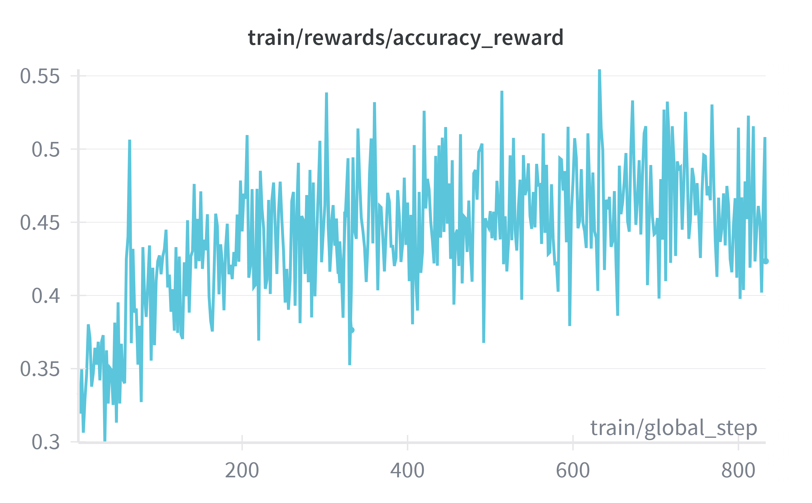
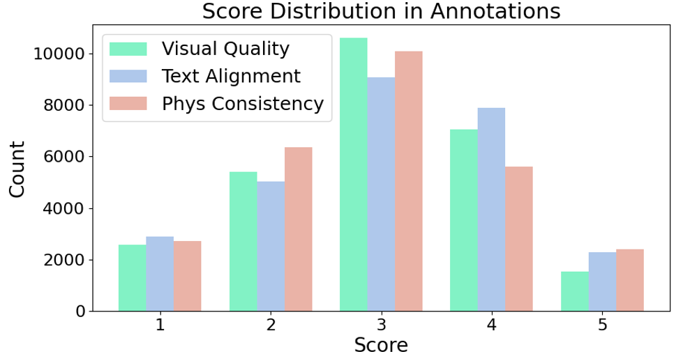

# VideoScore2

## 📌 核心贡献

> 提出 VideoScore2，一个多维度视频评估框架，通过链式思维推理（CoT）和两阶段训练（SFT + GRPO 强化学习）实现视觉质量、文本对齐和物理一致性三维度的结构化评分，在域内和域外基准上均大幅超越前代和基线模型。

## 📖 摘要

Recent advances in text-to-video generation have produced increasingly realistic and diverse content, yet evaluating such videos remains a fundamental challenge due to their multi-faceted nature encompassing visual quality, semantic alignment, and physical consistency. We introduce VideoScore2, a multi-dimensional framework assessing visual quality, text-to-video alignment, and physical consistency with chain-of-thought reasoning. Built on VideoFeedback2 (27,168 annotated videos) using supervised fine-tuning and reinforcement learning with GRPO, it achieves 44.35 accuracy on VideoScore-Bench-v2 and 50.37 average performance across four out-of-domain benchmarks.

## 🔍 关键信息

| 字段 | 内容 |
|------|------|
| 机构 | University of Waterloo |
| 发表 | 2025-09-26 |
| 分类 | cs.CV, cs.AI, cs.CL |
| 链接 | [arXiv](https://arxiv.org/abs/2509.22799) |

## 📝 我的笔记

### 方法总览

### 动机与问题定义

文本到视频生成的评估面临多方面挑战：视觉质量、语义对齐和物理一致性需要同时考虑。前代 VideoScore 仅输出单一分数，缺乏可解释性和多维度评估能力。VideoScore2 通过 CoT 推理和结构化评分解决这些问题。

### 方法细节

**两阶段训练流程：**

**阶段 1 - 监督微调（SFT）：**
- 基座模型：Qwen2.5-VL-7B-Instruct
- 训练数据：VideoFeedback2（27,168 个标注视频），含推理文本和多维度分数

**阶段 2 - 强化学习（GRPO）：**

奖励函数由准确性和格式两部分组成：

$$R = R_{\text{acc}} + \lambda R_{\text{fmt}}$$

- **准确性奖励（$R_{\text{acc}}$）**：三维度全对 1.0，两个匹配 0.7，一个匹配 0.4，均偏差 $\leq 1$ 则 0.1
- **格式奖励（$R_{\text{fmt}}$）**：包含 `<think>` 标签且有推理内容则为 1.0，否则为 0

**评分输出：** 使用 token 级概率生成归一化浮点分数（范围 $[1,5]$），比离散分数更精细。

### 关键结果

**域内性能（VideoScore-Bench-v2）：**

| 指标 | VideoScore2 | 最优基线 | 提升 |
|------|-------------|---------|------|
| Point Accuracy | 44.35% | 38.41% | +5.94% |
| Relaxed Accuracy | 90.78% | 86.77% | +4.01% |
| PLCC | 60.37 | 52.05 | +8.32 |

**域外性能（4 个基准平均）：**
- **50.37%** 平均性能（+4.32% vs 最优基线）
- 基准：VideoGenReward-Bench, T2VQA-DB, MJ-Bench-Video, VideoPhy2-test

**Ablation 关键发现：**

| 配置 | 域内准确率 |
|------|----------|
| SFT cold-start | 44.53% |
| RL without SFT | 36.70% |
| With CoT | 39.81% |
| Without CoT | 32.17% |

### 总结评价

VideoScore2 在前代基础上实现了三大改进：(1) 多维度评估替代单一分数；(2) CoT 推理提供可解释性（准确率提升 ~7.6%）；(3) GRPO 强化学习进一步提升对齐度。SFT cold-start 对 RL 的重要性（44.53% vs 36.70%）和归一化浮点分数的设计都值得关注。

## 🔗 相关论文

**基于/改进自：** [[VideoScore]]

**同方向：** [[VR-Thinker]]
