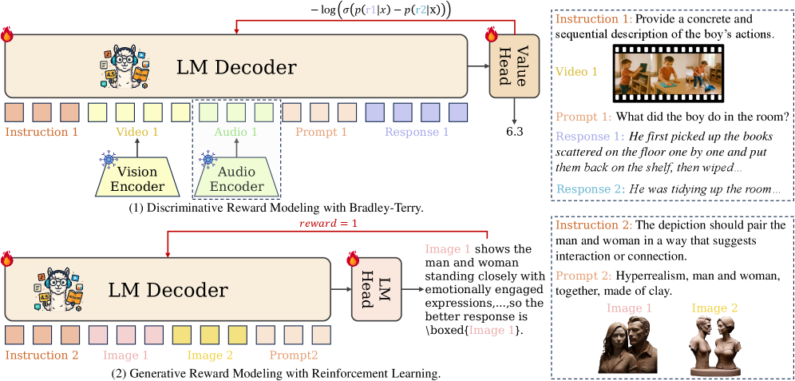
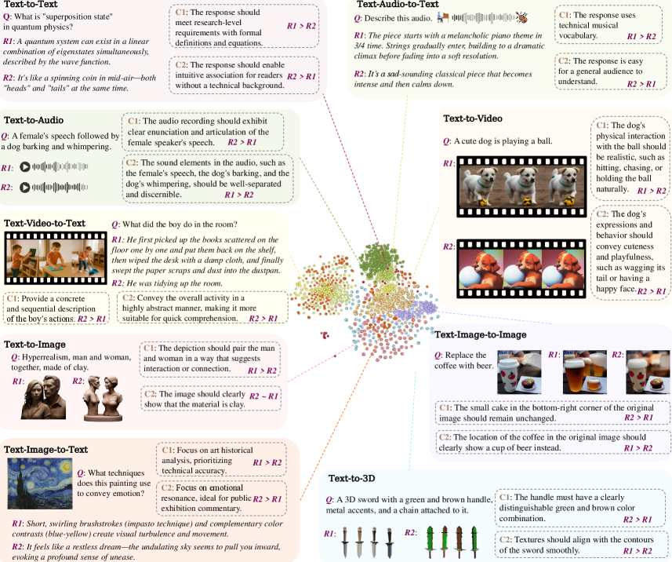
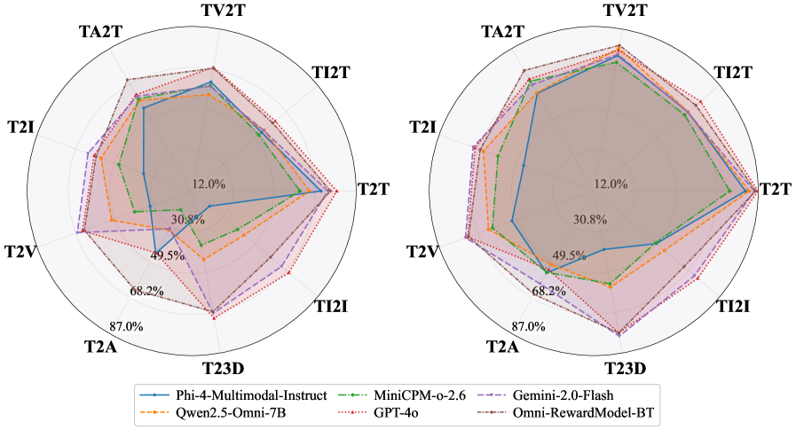

# Omni-Reward

## 📌 核心贡献

> 提出首个全模态（文本、图像、视频、音频、3D）奖励建模框架，包括覆盖 5 种模态 9 类任务的 Omni-RewardBench 基准、317K 偏好对的 Omni-RewardData 数据集，以及支持自由格式偏好描述的判别式（BT）和生成式（R1）奖励模型。

## 📖 摘要

Reward models (RMs) play a critical role in aligning AI behaviors with human preferences, yet they face two fundamental challenges: (1) Modality Imbalance, where most RMs are mainly focused on text and image modalities, offering limited support for video, audio, and other modalities; and (2) Preference Rigidity, where training on fixed binary preference pairs fails to capture the complexity and diversity of personalized preferences. To address the above challenges, we propose Omni-Reward, a step toward generalist omni-modal reward modeling with support for free-form preferences, consisting of: (1) Evaluation: We introduce Omni-RewardBench, the first omni-modal RM benchmark with free-form preferences, covering nine tasks across five modalities including text, image, video, audio, and 3D; (2) Data: We construct Omni-RewardData, a multimodal preference dataset comprising 248K general preference pairs and 69K instruction-tuning pairs for training generalist omni-modal RMs; (3) Model: We propose Omni-RewardModel, which includes both discriminative and generative RMs, and achieves strong performance on Omni-RewardBench as well as other widely used reward modeling benchmarks.

## 🔍 关键信息

| 字段 | 内容 |
|------|------|
| 机构 | Institute of Automation, Chinese Academy of Sciences / University of Chinese Academy of Sciences |
| 发表 | 2025-10-27 |
| 分类 | cs.CL, cs.AI, cs.CV |
| 链接 | [arXiv](https://arxiv.org/abs/2510.23451) |

## 📝 我的笔记

### 方法总览

### 动机与问题定义

现有奖励模型存在两个根本限制：

1. **模态不平衡（Modality Imbalance）**：绝大多数 RM 聚焦于文本和图像模态，对视频、音频、3D 等模态支持有限。
2. **偏好刚性（Preference Rigidity）**：基于固定二元偏好对训练，无法捕捉真实场景中个性化偏好的复杂性和多样性。用户的偏好标准往往是隐式的、多维度的。

Omni-Reward 旨在构建一个统一的全模态奖励建模框架，同时支持自由格式偏好描述（free-form preferences），使奖励模型能根据用户指定的评估准则进行自适应评分。

### 任务形式化

每个样本表示为五元组 $(x, y_1, y_2, c, p)$：

- $x$：输入 prompt
- $y_1, y_2$：两个候选回复
- $c$：自由格式评估准则（free-form criterion）
- $p$：偏好选择

两种评估设定：
- **w/o Ties**：$p \in \{y_1, y_2\}$
- **w/ Ties**：$p \in \{y_1, y_2, \text{tie}\}$

### Omni-RewardBench：全模态基准

覆盖 5 种模态、9 类任务，共 3,725 个高质量人工标注偏好对：

| 任务 | 描述 | 输入 → 输出 | 数据来源 |
|------|------|-------------|---------|
| T2T | 文本生成 | 指令 → 文本 | RMB, RPR (13 LLMs) |
| TI2T | 图像理解 | 指令 + 图像 → 文本 | VL-Feedback, MIA-Bench (14 MLLMs) |
| TV2T | 视频理解 | 指令 + 视频 → 文本 | VCGBench-Diverse (4 MLLMs) |
| TA2T | 音频理解 | 指令 + 音频 → 文本 | OpenAQA (4 MLLMs) |
| T2I | 图像生成 | 文本 → 图像 | Rapidata, HPDv2 (27 models) |
| T2V | 视频生成 | 文本 → 视频 | GenAI-Bench (8 models) |
| T2A | 音频生成 | 文本 → 音频 | Audio-alpaca, Tango |
| T23D | 3D 生成 | 文本 → 3D | 3DRewardDB, mvdream-sd2.1 |
| TI2I | 图像编辑 | 源图 + 指令 → 编辑图 | GenAI-Bench |

**标注质量控制：**
- 3 名计算机博士生独立标注
- 丢弃 23% 含无效准则的样本、15% 标注冲突的样本

### Omni-RewardData：训练数据

**通用偏好数据（248K 对）：**

| 任务 | 子集 | 数量 |
|------|------|------|
| T2T | Skywork-Reward-Preference | 50,000 |
| T2T | Omni-Skywork-Reward-Preference* | 16,376 |
| T2T | Omni-UltraFeedback* | 7,901 |
| T2I | HPDv2 | 50,000 |
| T2I | EvalMuse | 2,944 |
| T2I | Omni-HPDv2* | 8,959 |
| T2I | Omni-Open-Image-Preferences* | 8,105 |
| TI2T | RLAIF-V | 83,124 |
| TI2T | OmniAlign-V-DPO | 50,000 |
| TI2T | Omni-RLAIF-V* | 15,867 |
| TI2T | Omni-VLFeedback* | 12,311 |
| T2V | VideoDPO | 10,000 |
| T2V | VisionRewardDB-Video | 1,795 |

> 带 * 的是新构造的含自由格式偏好描述的子集，由 GPT-4o 生成准则 $c$。

**指令微调数据（69K 对）：** T2T (24K) + TI2T (28K) + T2I (17K)，用于提升模型对自由格式偏好的理解和遵循能力。

### 模型架构

#### 判别式模型（Omni-RewardModel-BT）

- **基座模型：** MiniCPM-o-2.6
- **冻结组件：** 视觉编码器、音频编码器
- **可训练组件：** 语言模型解码器 + 值头（value head）
- **用户偏好注入方式：** 将自由格式偏好描述 $c$ 作为 system message 输入

**Bradley-Terry 损失函数：**

$$\mathcal{L}_{BT} = -\log \frac{\exp(r_{BT}(c, x, y_c))}{\exp(r_{BT}(c, x, y_c)) + \exp(r_{BT}(c, x, y_r))}$$

其中 $r_{BT}(\cdot)$ 为标量奖励函数，$c$ 为自由格式评估准则，$y_c$ 为被选回复，$y_r$ 为被拒回复。

#### 生成式模型（Omni-RewardModel-R1）

- **基座模型：** Qwen2.5-VL-7B-Instruct
- **生成过程：** 给定 $(c, x, y_1, y_2)$，模型先输出 Chain-of-Thought 解释 $e$，再输出偏好预测 $p'$
- **训练框架：** GRPO 强化学习
- **训练数据：** 仅 10K 样本（约占 Omni-RewardData 的 3%）
- **奖励信号：** 对比 $p'$ 与 ground-truth $p$
- **无需蒸馏：** 不依赖大模型蒸馏

### 关键结果

#### Omni-RewardBench 主实验（w/ Ties）

| 模型 | T2T | TI2T | TV2T | TA2T | T2I | T2V | T2A | T23D | TI2I | Overall |
|------|-----|------|------|------|-----|-----|-----|------|------|---------|
| GPT-4o | 78.18 | 61.74 | 69.30 | 62.75 | 59.33 | 65.03 | 44.53 | 70.86 | 69.87 | 64.62 |
| Claude-3.5-Sonnet | 76.74 | 61.55 | 67.04 | - | 61.69 | 64.27 | - | 68.54 | 65.94 | 66.54 |
| Gemma-3-27B-it | 77.22 | 61.17 | 67.04 | - | 59.14 | 61.44 | - | 63.91 | 65.94 | 65.12 |
| Qwen2.5-VL-32B | 74.82 | 60.23 | 63.88 | - | 60.51 | 62.38 | - | 62.58 | 69.43 | 64.83 |
| UnifiedReward1.5 | 59.47 | 54.17 | 69.30 | - | 58.35 | 69.57 | - | 61.59 | 45.41 | 59.69 |
| **Omni-RewardModel-R1** | 71.22 | 56.06 | 63.88 | - | 61.69 | 58.22 | - | 63.91 | 46.29 | 60.18 |
| **Omni-RewardModel-BT** | **75.30** | **60.23** | **68.85** | **70.59** | **58.35** | **64.08** | **63.99** | **67.88** | **58.95** | **65.36** |

> Omni-RewardModel-BT 是唯一支持全部 5 种模态 9 类任务的开源模型，Overall 65.36% 超过大部分开源模型，接近 Claude-3.5-Sonnet (66.54%)。

#### Omni-RewardBench（w/o Ties）

| 模型 | Overall |
|------|---------|
| Claude-3.5-Sonnet | 76.66 |
| Gemma-3-27B-it | 75.27 |
| GPT-4o-mini | 74.42 |
| Qwen2.5-VL-72B | 74.02 |
| **Omni-RewardModel-BT** | **73.68** |
| Omni-RewardModel-R1 | 69.71 |
| UnifiedReward1.5 | 68.79 |

#### VL-RewardBench 结果

| 模型 | General | Hallucination | Reasoning | Overall Acc | Macro Acc |
|------|---------|---------------|-----------|-------------|-----------|
| Skywork-VL-Reward | 66.0 | 80.0 | 61.0 | 73.1 | 69.0 |
| UnifiedReward | 60.6 | 78.4 | 60.5 | 66.1 | 66.5 |
| IXC-2.5-Reward | 84.7 | 62.5 | 62.9 | 65.8 | 70.0 |
| GPT-4o | 49.1 | 67.6 | 70.5 | 65.8 | 62.4 |
| **Omni-RewardModel-R1** | 71.9 | 90.2 | 59.0 | 69.6 | 73.7 |
| **Omni-RewardModel-BT** | **81.5** | **94.2** | **60.4** | **76.3** | **78.7** |

> Omni-RewardModel-BT 在 VL-RewardBench 上 Macro Acc 达到 78.7%，显著超越所有基线（包括 IXC-2.5-Reward 70.0%），尤其在 Hallucination 检测（94.2%）上表现突出。

#### Multimodal RewardBench 结果

| 模型 | Overall | General | Knowledge | Reasoning | Safety | VQA | Correctness | Math |
|------|---------|---------|-----------|-----------|--------|-----|-------------|------|
| Claude 3.5 Sonnet | 72.0 | 62.6 | 67.8 | 73.9 | 68.6 | 65.1 | 76.8 | 85.6 |
| Gemini 1.5 Pro | 72.0 | 63.5 | 67.7 | 66.3 | 68.9 | 55.5 | 94.5 | 87.2 |
| GPT-4o | 71.5 | 62.6 | 69.0 | 72.0 | 67.6 | 62.1 | 74.8 | 87.2 |
| **Omni-RewardModel-BT** | **70.5** | **71.3** | **58.4** | **66.7** | **71.0** | **48.5** | **79.3** | **85.1** |

> BT 模型在 Multimodal RewardBench 上 70.5%，接近顶级闭源模型水平，且在 General (71.3%) 和 Safety (71.0%) 上超越 GPT-4o。

### Ablation 分析

**训练数据组合的影响（w/ Ties）：**

| 训练数据 | T2T | TI2T | T2I | T2V | T23D | Overall |
|----------|-----|------|-----|-----|------|---------|
| MiniCPM-o-2.6 基线 | 61.39 | 51.89 | 47.35 | 39.70 | 37.09 | 46.67 |
| 仅 T2T 数据 | 74.30 | 54.73 | 45.38 | 43.86 | 49.67 | 57.13 |
| 仅 TI2T 数据 | 74.54 | 59.62 | 41.45 | 48.77 | 51.00 | 58.84 |
| 仅 T2I & T2V 数据 | 52.28 | 45.83 | 58.93 | 64.84 | 67.55 | 57.50 |
| 全部数据 | **75.30** | **60.23** | **58.35** | **64.08** | **67.88** | **65.36** |
| 仅偏好数据（无 SFT） | 54.92 | 49.80 | 59.14 | 61.06 | 64.90 | 58.67 |

**关键发现：**
- 混合全部模态数据训练 (65.36%) 显著优于任何单模态子集 (~57-59%)
- 指令微调数据至关重要：移除 69K SFT 数据后性能从 65.36% 降至 58.67%（下降 6.69%）
- 理解类任务（T2T, TI2T）的训练数据对生成类任务有正向迁移
- 跨模态任务间的 Pearson 相关系数：理解类任务内部 0.8-0.9，生成类任务内部 0.7-0.8

### 总结评价

**优势：**
1. 首个覆盖 5 种模态 9 类任务的统一 RM 框架，填补了 audio / 3D 模态的奖励建模空白
2. 自由格式偏好描述使 RM 可适应个性化评估需求，突破了传统二元偏好的局限
3. BT 模型在多个公开基准上接近或超越闭源模型，R1 模型用仅 3% 数据就达到了不错的性能
4. Omni-RewardBench 设计严谨，3,725 个样本经过严格质控

**局限：**
1. BT 模型基于 MiniCPM-o-2.6，模型规模和能力受基座限制
2. 音频和 3D 模态的训练数据量远少于文本和图像，性能差距仍然显著
3. R1 模型不支持 audio 模态（受限于 Qwen2.5-VL 的模态支持）
4. 不同任务间性能方差高达 28.37%，全模态均衡性仍有提升空间

## 🔗 相关论文

**基于/改进自：** [[UnifiedReward]]

**同方向：** [[UnifiedReward-Flex]], [[UnifiedReward-Think]], [[VL-RewardBench]], [[VisionReward]], [[VideoScore]], [[IXC-2.5-Reward]], [[Skywork-VL-Reward]]
