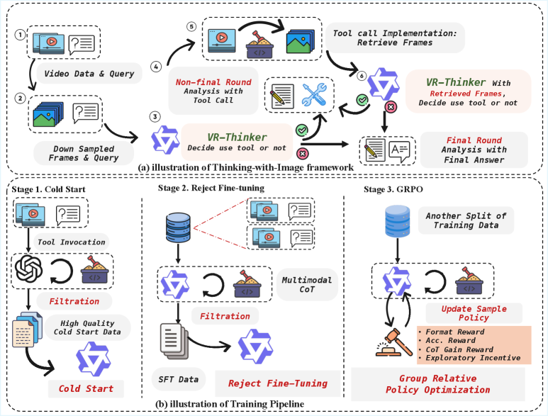
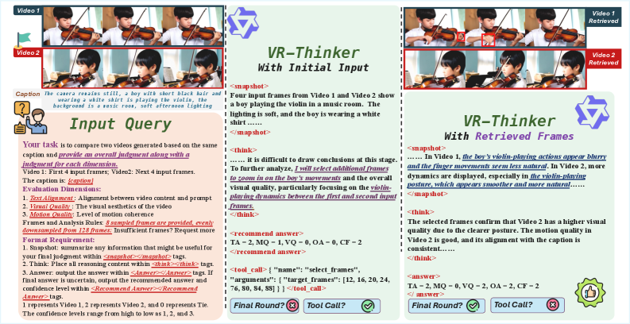
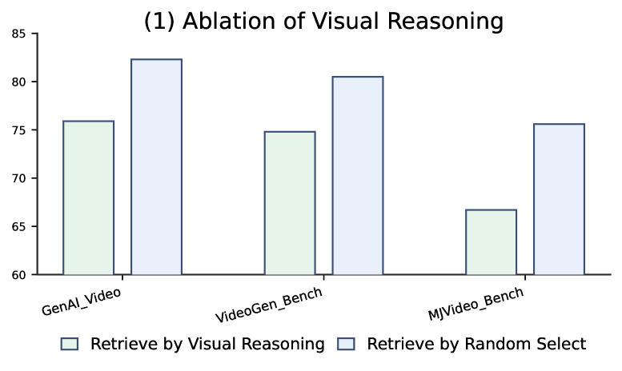

# VR-Thinker

## 📌 核心贡献

> 提出 thinking-with-image 框架，让视频奖励模型在推理过程中主动调用帧选择工具获取视觉证据，结合滑动窗口记忆机制和三阶段强化微调流程（Cold Start + 拒绝采样 + GRPO），在视频偏好评估基准上达到开源 SOTA。

## 📖 摘要

Recent advancements in multimodal reward models (RMs) have substantially improved post-training for visual generative models. However, current RMs face inherent limitations: (1) visual inputs consume large context budgets, forcing fewer frames and causing loss of fine-grained details; and (2) all visual information is packed into the initial prompt, exacerbating hallucination and forgetting during chain-of-thought reasoning. To overcome these issues, we introduce VideoReward Thinker (VR-Thinker), a thinking-with-image framework that equips the RM with visual reasoning operations (e.g., select frame) and a configurable visual memory window. This allows the RM to actively acquire and update visual evidence within context limits, improving reasoning fidelity and reliability. We activate visual reasoning via a reinforcement fine-tuning pipeline: (i) Cold Start with curated visual chain-of-thought data to distill basic reasoning skills and operation formatting; (ii) select samples whose per-dimension and overall judgments are all correct, then conduct Rejection sampling Fine-Tuning on these high-quality traces to further enhance reasoning; and (iii) apply Group Relative Policy Optimization (GRPO) to strengthen reasoning. Our approach delivers state-of-the-art accuracy among open-source models on video preference benchmarks, especially for longer videos: a 7B VR-Thinker achieves 80.5% on VideoGen Reward, 82.3% on GenAI-Bench, and 75.6% on MJ-Bench-Video. These results validate the effectiveness and promise of thinking-with-image multimodal reward modeling.

## 🔍 关键信息

| 字段 | 内容 |
|------|------|
| 机构 | CUHK MMLab, Kuaishou Technology, Nanjing University |
| 发表 | 2025-10-12 |
| 分类 | cs.CV |
| 链接 | [arXiv](https://arxiv.org/abs/2510.10518) |

## 📝 我的笔记

### 方法总览

### 动机与问题定义

当前多模态奖励模型在视频偏好评估中面临两个核心瓶颈：

1. **上下文预算受限**：视觉输入占用大量 token，迫使模型采样更少的帧，丢失细粒度细节
2. **信息遗忘**：所有视觉信息在初始 prompt 中一次性嵌入，在后续 chain-of-thought 推理过程中模型仅以文本形式推进，无法回溯视觉证据，导致幻觉和遗忘

核心洞察：奖励模型应在推理过程中**主动与视觉信息交互**，而非将其视为静态初始上下文。

### 方法细节

#### 1. Thinking-with-Image 框架

三个核心组件：

**工具调用（Tool Invocation）**：模型可迭代调用帧选择工具，从视频中检索初始下采样帧之外的视觉证据。给定初始输入 $\mathcal{X} = [\mathcal{V}, T]$，模型生成推理单元 $r_t \sim \pi_\theta(\cdot|\mathcal{X}, \tilde{R}_{t-1})$，并调用工具 $f$ 获取结果 $o_t = f(\tilde{\mathcal{V}})$。

**滑动窗口记忆（Window Memory）**：保持最近 $p$ 个工具输出的滑动窗口，而非无限保留所有检索帧。总 token 使用量近似恒定：

$$\mathcal{T}_{total} \approx (N_{in} + pN_{ex})V_t$$

其中 $N_{in}$ 为初始帧数，$N_{ex}$ 为每次检索帧数，$V_t$ 为每帧 token 数。

**推理格式**：使用 XML 风格标签组织推理流程：
- `<think>`：推理内容
- `<Snapshot>`：工具执行后的视觉信息语言摘要
- `<Recommend Answer>`：非最终段的中间置信度评估
- `<Answer>`：最终判断

#### 2. 三阶段训练管线

**阶段一 - Cold Start**：使用 GPT-4o 生成高质量 CoT 数据，经两阶段过滤（格式合规 + 标签正确），进行监督微调（mask 工具执行结果 token）：

$$\mathcal{L}_{sft}(\theta) = -\sum_{i=1}^t \sum_{j=1}^{N_i} \log p(r_{i,j}|\mathcal{X}, (r_1,o_1),...,(r_{i-1},o_{i-1}), r_{i,<j}; \theta)$$

**阶段二 - 拒绝采样微调（Rejection Sampling Fine-Tuning）**：从阶段一模型采样多个 CoT 输出，仅保留所有维度判断和整体判断均正确的样本，在这些高质量验证轨迹上进行 SFT。

**阶段三 - GRPO（Group Relative Policy Optimization）**：对每个输入 $\mathcal{X}$ 采样 $n$ 个 CoT 样本，计算奖励并归一化优势：

$$\mathcal{A}_i = \frac{s_i - \mu(S)}{\sigma(S)}$$

GRPO 目标函数：

$$\mathcal{J}_{grpo}(\theta) = \mathbb{E}\left[\frac{1}{\mathcal{T}} \sum_{t=1}^{\mathcal{T}} \left\{\min\left(\zeta_{i,t}, \text{clip}(\zeta_{i,t}, 1-\epsilon, 1+\epsilon)\right)\mathcal{A}_i - \beta \mathbb{D}_{KL}[\pi_\theta||\pi_{ref}]\right\}\right]$$

#### 3. 奖励函数设计

- **格式奖励（Format Reward）**：验证 XML 标签结构和答案格式合规
- **准确性奖励（Accuracy Reward）**：结合整体和各维度判断，将答案空间从 3 扩展到 $3^{d+1}$（$d$ 为评估维度数）：

$$r_{acc} = \alpha \cdot r_{acc\_all} + \bar{\alpha} \cdot r_{acc\_dim}$$

- **CoT 增益奖励（CoT Gain Reward）**：鼓励视觉推理带来准确性提升：$r_{cot} = k \cdot \sum_{i=1}^{t-1} \Delta r_i$
- **探索激励（Exploratory Incentive）**：通过 Lagrangian 松弛强制最低多模态推理比例，防止模型退化为纯文本推理

### 关键结果

#### 主要基准结果

| 模型 | 参数量 | GenAI-Bench (tau/diff) | VideoGen-Reward (tau/diff) | MJ-Bench-Video (tau/diff) |
|------|--------|------------------------|----------------------------|---------------------------|
| VideoScore | 7B | 47.5/70.9 | 41.9/50.2 | 57.9/63.5 |
| VideoReward | 2B | 49.9/73.1 | 60.8/73.8 | 56.8/62.6 |
| VisionReward | 13B | 52.6/72.7 | 57.9/68.4 | 54.1/65.2 |
| LiFT | 13B | 38.1/59.4 | 40.1/57.9 | 42.5/51.4 |
| UnifiedReward | 7B | 61.2/76.8 | 67.1/78.6 | 63.3/69.5 |
| UnifiedReward-Think | 7B | 64.7/80.4 | 69.7/79.1 | 62.8/71.9 |
| **VR-Thinker** | **7B** | **68.7/82.3** | **71.8/80.5** | **67.3/75.6** |

#### 困难子集结果（长视频 & 复杂 Prompt）

VR-Thinker 在长视频和复杂 prompt 场景下性能退化更小：

| 模型 | 长视频 GenAI (tau/diff) | 长视频 VideoGen (tau/diff) | 长视频 MJ-Bench (tau/diff) |
|------|--------------------------|-----------------------------|-----------------------------|
| UnifiedReward | 56.8/71.6 | 63.5/72.2 | 59.6/67.3 |
| UnifiedReward-Think | 61.7/76.4 | 65.8/76.7 | 60.1/69.6 |
| **VR-Thinker** | **66.2/81.4** | **70.9/79.6** | **66.1/74.8** |

### Ablation 分析

关键发现：

1. **视觉推理必要性**：随机帧检索 vs 模型引导选择性能差距明显，验证了主动视觉推理的必要性
2. **训练阶段消融**：三个阶段逐步叠加带来持续提升，Cold Start + 拒绝采样 + GRPO 三阶段缺一不可
3. **辅助奖励消融**：CoT Gain Reward 和 Exploratory Incentive 移除后性能均显著下降
4. **准确性奖励配置**：$\alpha=0.5$（整体+各维度 50/50 混合）效果最优

### 关键超参数

| 参数 | 值 | 说明 |
|------|-----|------|
| 基座模型 | Qwen2.5-VL-7B | |
| $\alpha$ | 0.5 | 整体/维度准确性平衡 |
| $k$ | 0.2 | CoT 增益强度 |
| $\eta$ | 0.5 | 探索激励系数 |
| $\omega$ | 0.2 | 最低多模态比例 |
| $p$ | 1 | 窗口宽度 |
| GRPO lr | $10^{-6}$ | |
| GRPO $\beta$ | 0.01 | KL 惩罚系数 |
| GPU | 32x A800 (GRPO) | |

### 总结性评价

VR-Thinker 的核心创新在于将"推理时主动获取视觉证据"的范式引入视频奖励模型。滑动窗口记忆设计优雅地解决了上下文膨胀问题，使 token 用量与推理步数解耦。三阶段训练管线（SFT 冷启动 -> 拒绝采样 -> GRPO）是 reasoning RM 训练的成熟方案。四种奖励信号的设计（特别是 CoT Gain 和 Exploratory Incentive）针对性地解决了"视觉推理退化为文本推理"的问题。在 7B 参数量下全面超越包括 13B 模型在内的所有开源基线，尤其在长视频和复杂 prompt 等困难场景下优势更为突出。

## 🔗 相关论文

**基于/改进自：** [[UnifiedReward-Think]]

**同方向：** [[RewardDance]], [[SoliReward]], [[UnifiedReward]]
