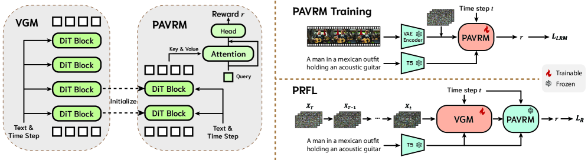
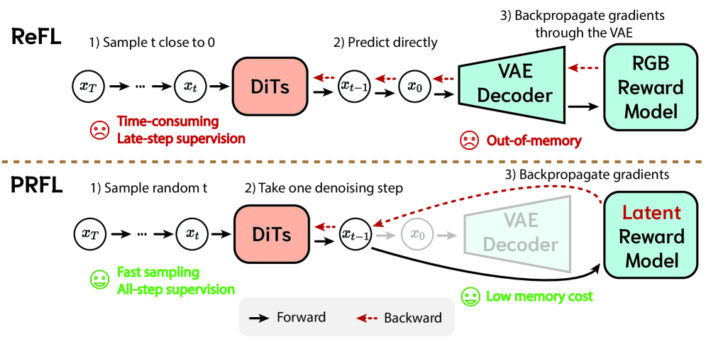
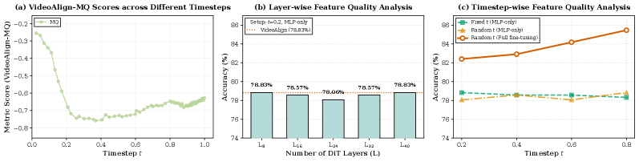

# LatentRM

## 📌 核心贡献

> 提出利用预训练视频生成模型本身作为噪声潜空间中的奖励模型（PAVRM），并设计 Process Reward Feedback Learning（PRFL）框架，在潜空间中完成全去噪链的偏好优化，无需 VAE 解码，显著降低显存消耗和训练时间。

## 📖 摘要

Reward feedback learning (ReFL) has proven effective for aligning image generation with human preferences. However, its extension to video generation faces significant challenges. Existing video reward models rely on vision-language models designed for pixel-space inputs, confining ReFL optimization to near-complete denoising steps after computationally expensive VAE decoding. This pixel-space approach incurs substantial memory overhead and increased training time, and its late-stage optimization lacks early-stage supervision, refining only visual quality rather than fundamental motion dynamics and structural coherence. In this work, we show that pre-trained video generation models are naturally suited for reward modeling in the noisy latent space, as they are explicitly designed to process noisy latent representations at arbitrary timesteps and inherently preserve temporal information through their sequential modeling capabilities. Accordingly, we propose Process Reward Feedback Learning (PRFL), a framework that conducts preference optimization entirely in latent space, enabling efficient gradient backpropagation throughout the full denoising chain without VAE decoding. Extensive experiments demonstrate that PRFL significantly improves alignment with human preferences, while achieving substantial reductions in memory consumption and training time compared to RGB ReFL.

## 🔍 关键信息

| 字段 | 内容 |
|------|------|
| 机构 | University of Chinese Academy of Sciences, Tencent Hunyuan 等 |
| 发表 | 2025-11-26 |
| 分类 | cs.CV |
| 链接 | [arXiv](https://arxiv.org/abs/2511.21541) |

## 📝 我的笔记

### 动机与问题定义

现有视频生成对齐方法（如 RGB ReFL）面临三个核心问题：

1. **计算瓶颈**：需要将噪声潜变量完全去噪后通过 VAE 解码到像素空间，才能用 VLM-based 奖励模型评估，导致 OOM 或巨大显存开销
2. **优化滞后**：只能在接近完成去噪的后期阶段提供监督，缺乏对早期运动规划和结构一致性的引导
3. **信息丢失**：VLM 奖励模型设计用于处理像素空间输入，在噪声潜空间中表现急剧下降

核心洞察：预训练的视频生成模型（VGM）天然适合在噪声潜空间中做奖励建模，因为它们被显式训练来处理任意时间步的噪声潜变量表示，并通过序列建模能力固有地保留时间信息。

### 方法总览

#### 1. Process-Aware Video Reward Model (PAVRM)

复用预训练 VGM 的前 8 层 DiT blocks 作为特征提取器，在噪声潜空间中直接评估视频质量。

**特征提取**：

$$h = \text{DiT}_\phi(x_t, t, T(p)) \in \mathbb{R}^{F \times H \times W \times D}$$

其中 $x_t$ 为时间步 $t$ 的噪声潜变量，$T(p)$ 为文本编码器输出。

**Query-Based 时空聚合**：使用可学习 query 向量通过注意力机制聚合变长时空特征：

$$z_{\text{obs}} = \text{softmax}\left(\frac{q(\hat{h}W_K)^T}{\sqrt{D}}\right) (\hat{h}W_V) \in \mathbb{R}^{1 \times D}$$

最终表示 $z = z_{\text{obs}} + q$，通过三层 MLP 映射为奖励分数。

**训练目标**（二分类交叉熵 + 随机时间步采样）：

$$\mathcal{L}_{\text{PAVRM}} = -\mathbb{E}_{t, (V, p, y)} \left[ y \log \sigma(r_\phi(x_t, t, p)) + (1-y) \log(1 - \sigma(r_\phi(x_t, t, p))) \right]$$

其中 $t \sim U(0,1)$ 使模型适应任意噪声水平。

#### 2. Process Reward Feedback Learning (PRFL)

在潜空间中完成偏好优化，无需 VAE 解码。

**Rectified Flow 框架**：

$$x_t = (1-t)x_0 + tx_1, \quad t \in [0,1]$$

**PRFL 损失**：

$$\mathcal{L}_{\text{PRFL}} = -\lambda \mathbb{E}_{s, p}[r_\phi(x_s, s, p)]$$

**训练算法**（两阶段交替）：

- **SFT 正则化阶段**：标准 flow matching 损失，防止模型退化
  $$\mathcal{L}_{\text{FM}} = \|v_\theta(x_t, t, p) - (x_1 - x_0)\|_2^2$$
- **PRFL 奖励反馈阶段**：从 $t=T$ 开始无梯度 rollout 到随机采样的时间步 $s$，仅在该步启用梯度反传

关键设计：随机时间步采样使学习信号分布在整个生成轨迹上，早期阶段引导运动规划，后期阶段优化视觉质量。

### VGM 特征分析

三个关键发现：
1. VLM-based 奖励模型在噪声潜空间中表现极差，分数剧烈波动
2. VGM 的任意 DiT 层特征（L8-L40）均能达到 78.8% 准确率，说明运动动态信息均匀分布在网络中
3. 时间步感知微调（随机时间步 + 全参数微调）将准确率从 78.8% 提升到 85.46%，超越 VLM 基线

### 关键实验结果

#### Text-to-Video 生成（480P）

| 方法 | Motion Smoothness | Dynamic Degree | Subject Consistency | Human Anatomy | PAVRM |
|------|------------------|----------------|---------------------|---------------|-------|
| Pretrain | 99.20 | 22.00 | 97.34 | 84.24 | 89.00 |
| SFT | 98.96 | 44.00 | 96.61 | 92.79 | 92.00 |
| RWR | 98.99 | 60.00 | 95.93 | 91.85 | 88.00 |
| RGB ReFL | 99.20 | 38.00 | 92.26 | 91.68 | 92.00 |
| **PRFL** | **99.05** | **68.00** | **96.34** | **94.73** | **92.00** |

PRFL 在 Dynamic Degree 上相比 Pretrain 提升 +46.00，Human Anatomy 提升 +10.49，同时保持了 Motion Smoothness 和 Subject Consistency。

#### Image-to-Video 生成（480P）

| 方法 | Motion Smoothness | Dynamic Degree | Subject Consistency | Image Consistency | PAVRM |
|------|------------------|----------------|---------------------|-------------------|-------|
| Pretrain | 98.66 | 57.00 | 91.73 | 96.86 | 87.00 |
| **PRFL** | **98.88** | **87.00** | **93.18** | **97.31** | **93.00** |

Dynamic Degree 提升 +30.00，各项指标全面提升。

#### 计算效率对比

| 方法 | VRAM (GB) | 时间/步 (s) | 加速比 |
|------|-----------|-------------|--------|
| RGB ReFL (全帧) | OOM | - | - |
| RGB ReFL (首帧) | 55.47 | 72.38 | 1.00x |
| **PRFL (全帧)** | **66.81** | **51.11** | **1.42x** |

PRFL 处理全部 81 帧仍实现 1.42x 加速，RGB ReFL 处理全帧直接 OOM。

#### 时间步敏感性分析

| 阶段 | Dynamic Degree | Human Anatomy | 平均分 |
|------|---------------|---------------|--------|
| Early (t∈[0, 0.33]) | 51.00 | 85.00 | 82.25 |
| Middle (t∈[0.33, 0.67]) | 51.00 | 92.00 | 87.02 |
| Late (t∈[0.67, 1.0]) | 44.00 | 93.00 | 85.01 |
| **Full [0, 1]** | **68.00** | **92.00** | **89.58** |

全范围采样效果最优。早期/中期阶段主导运动质量，后期阶段改善结构准确性。

#### 奖励模型聚合方式对比

| 方法 | [0, 0.2] | (0.2, 0.4] | (0.4, 0.6] | (0.6, 0.8] | (0.8, 1.0] | 平均 |
|------|----------|------------|------------|------------|------------|------|
| VideoAlign (VLM) | - | - | - | - | - | 78.83 |
| Mean Pooling | 82.40 | 82.91 | 83.67 | 85.46 | 82.40 | 83.37 |
| Max Pooling | 80.61 | 80.10 | 80.61 | 77.30 | 73.72 | 78.47 |
| Attention w/o query | 80.36 | 84.44 | 84.95 | 84.18 | 83.16 | 83.42 |
| **Attention w/ query** | **83.42** | **84.95** | **84.69** | **84.44** | **83.42** | **84.18** |

Query-based attention 在所有时间步范围内保持 83%+ 准确率，稳定性最佳。

### 总结性评价

这篇论文的核心洞察非常优雅：既然视频生成模型本身就被训练来理解各个时间步的噪声潜变量，那它自然就是最好的潜空间奖励模型。PRFL 框架在三个维度上同时取得了进步：

1. **效率**：避免 VAE 解码，全帧处理仍比 RGB ReFL 单帧快 1.42x
2. **效果**：全去噪链优化带来更好的运动动态和结构一致性
3. **简洁**：直接复用 VGM 前 8 层 + 可学习 query + MLP head，无需额外引入 VLM

局限性在于仍依赖二分类偏好数据训练 PAVRM，且实验主要在 Tencent Hunyuan Video 上验证，泛化性有待考察。

## 🔗 相关论文

**基于/改进自：** [[VideoAlign]]

**同方向：** [[RewardDance]], [[VideoScore]], [[SoliReward]]
