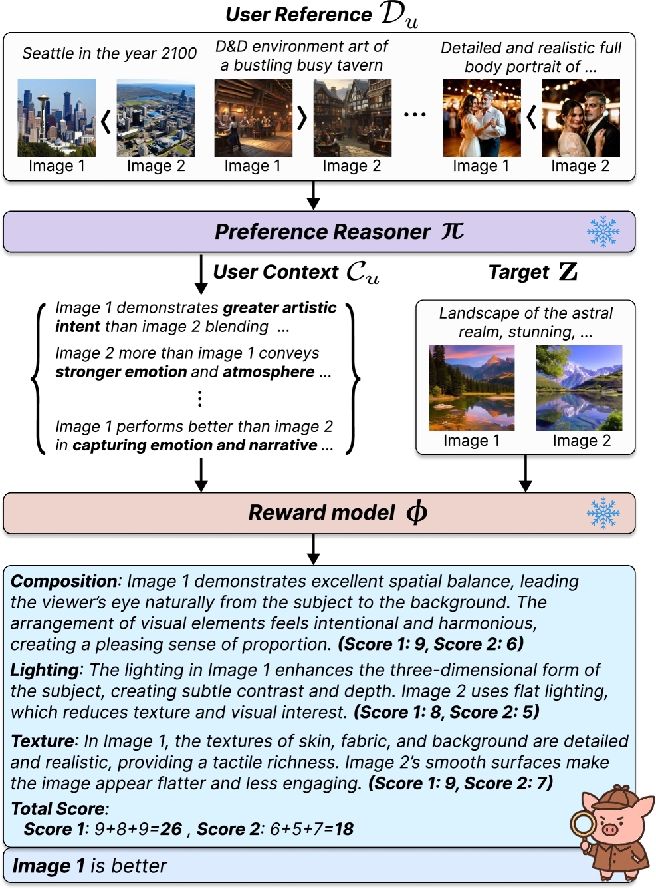
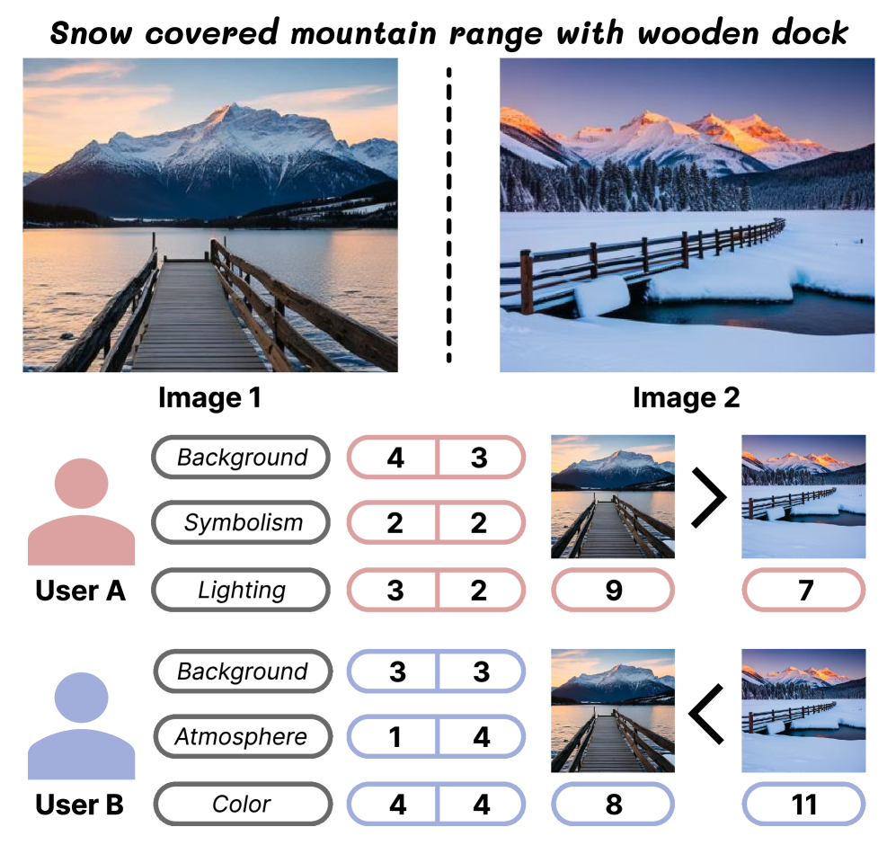
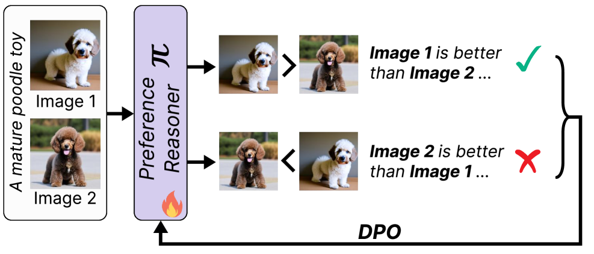

# PIGReward

## 📌 核心贡献

> 提出个性化奖励模型 PIGReward，通过动态生成用户条件化的评估维度和 CoT 推理进行个性化 T2I 评估，无需用户特定训练，并引入 PIGBench 个性化偏好基准。

## 📖 摘要

Recent text-to-image (T2I) models generate semantically coherent images from textual prompts, yet evaluating how well they align with individual user preferences remains an open challenge. Conventional evaluation methods, general reward functions or similarity-based metrics, fail to capture the diversity and complexity of personal visual tastes. In this work, we present PIGReward, a personalized reward model that dynamically generates user-conditioned evaluation dimensions and assesses images through CoT reasoning. To address the scarcity of user data, PIGReward adopt a self-bootstrapping strategy that reasons over limited reference data to construct rich user contexts, enabling personalization without user-specific training. Beyond evaluation, PIGReward provides personalized feedback that drives user-specific prompt optimization, improving alignment between generated images and individual intent. We further introduce PIGBench, a per-user preference benchmark capturing diverse visual interpretations of shared prompts. Extensive experiments demonstrate that PIGReward surpasses existing methods in both accuracy and interpretability, establishing a scalable and reasoning-based foundation for personalized T2I evaluation and optimization.

## 🔍 关键信息

| 字段 | 内容 |
|------|------|
| 机构 | Yonsei University |
| 发表 | 2025-11-21 |
| 分类 | cs.CV, cs.AI |
| 链接 | [arXiv](https://arxiv.org/abs/2511.19458) |

## 📝 我的笔记

### 方法总览

### 动机与问题定义

T2I 评估的核心挑战：**个性化**。不同用户对同一组图像有截然不同的偏好，通用奖励模型无法捕捉这种多样性。现有方法（通用奖励函数、相似度指标）无法满足个体化视觉品味的评估需求。

### 方法细节

PIGReward 包含两个核心组件，均基于 Qwen2-VL-7B：

**1. Preference Reasoner ($\pi$)：**
- 处理用户参考数据，生成解释偏好决策的推理理由
- 通过 DPO 损失训练：

$$\mathcal{L}_\pi = -\mathbb{E}[\log \sigma(\beta \Delta_i)]$$

其中 $\Delta_i$ 对比正确 vs 错误推理理由的对数概率比

**2. Reward Model ($\phi$)：**
- 利用用户上下文评估目标图像对
- 动态生成评估维度，进行 CoT 推理
- 语言建模损失训练（GPT-4o 生成的 CoT 数据蒸馏）：

$$\mathcal{L}_\phi = -\mathbb{E} \sum \log \phi(y_{i,t} | x_i, y_{i,<t})$$

**自引导策略 (Self-Bootstrapping)：**
在有限参考数据上进行推理，构建丰富的用户上下文，无需用户特定训练。

**训练流程：**
1. 在 Pick-a-Pic 通用偏好数据集上用 hint-driven sampling 微调 $\pi$
2. GPT-4o 生成 4K CoT 训练样本并质量过滤
3. 在高质量数据上蒸馏 $\phi$

### 关键实验结果

| 数据集 | PIGReward (w/ tie) | PIGReward (w/o tie) | 最佳基线 |
|--------|-------------------|-------------------|---------|
| Pick-a-Pic | **63.76%** | **62.14%** | 61.52% (Qwen2-VL) |
| PIP | **77.84%** | **78.59%** | 76.23% (GPT-4o) |
| PASTA | **75.43%** | **74.43%** | 69.86% (UnifiedReward) |
| PIGBench | **84.91%** | **85.85%** | 68.29% (GPT-4o) |

**消融实验：**

| 配置 | Pick-a-Pic | PIGBench |
|------|-----------|----------|
| 完整模型 | 63.76% | 84.91% |
| 无 CoT | 44.43% | 39.62% |
| 仅 CoT | 48.94% | 56.94% |

CoT 推理和用户上下文对性能都至关重要。

### 总结

PIGReward 开辟了个性化 T2I 奖励建模的新方向。核心设计亮点：(1) 动态评估维度生成避免了固定维度的局限；(2) 自引导策略实现了无需用户特定训练的个性化；(3) PIGBench 基准填补了个性化评估的空白。在 PIGBench 上大幅超越 GPT-4o（84.91% vs 68.29%）令人印象深刻。

## 🔗 相关论文

**同方向：** [[UnifiedReward-Flex]], [[HPSv3]]
