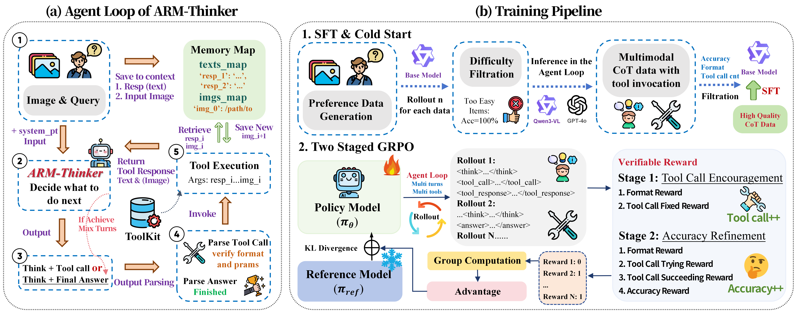
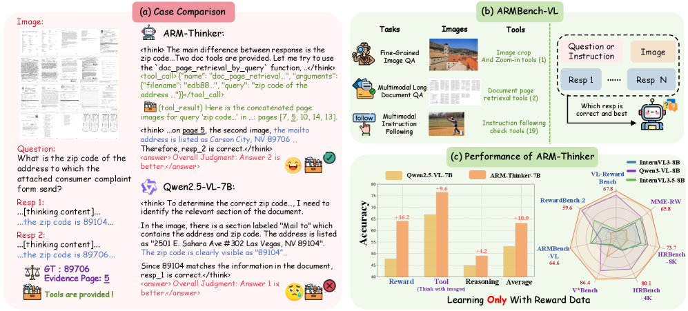
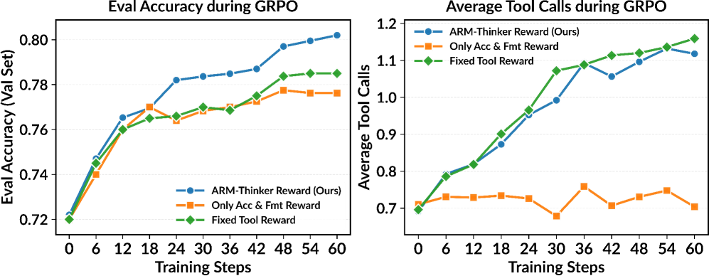

# ARM-Thinker

## 📌 核心贡献

> 提出 ARM-Thinker，首个具备 Agentic 工具调用能力的多模态奖励模型，通过 Think-Act-Observe 循环自主调用外部工具（图像裁剪、文档检索、指令验证）来获取可验证证据，并使用两阶段 GRPO 训练联合优化工具调用策略与判断准确性，在奖励模型基准上平均提升 +16.2%，工具使用任务提升 +9.6%。

## 📖 摘要

Reward models are critical for aligning vision-language systems with human preferences, yet current approaches suffer from hallucination, weak visual grounding, and an inability to use tools for verification, limiting their reliability on complex multimodal reasoning tasks. We present ARM-Thinker, an Agentic multimodal Reward Model that autonomously invokes external tools (e.g., image cropping, doc page retrieval) to ground judgments in verifiable evidence, replacing static, non-interactive reward scoring. This enables the model to verify fine-grained visual details, cross-reference multi-page evidence, and validate reasoning claims, which are capabilities absent in existing reward models. We train ARM-Thinker with multi-stage reinforcement learning, jointly optimizing tool-calling decisions and judgment accuracy. To evaluate agentic reward modeling, we introduce ARMBench-VL, comprising three benchmarks that assess fine-grained visual grounding (image-level tools), multi-page document understanding (retrieval tools), and instruction following (text-level verification). ARM-Thinker achieves +16.2% average improvement on reward modeling benchmarks, +9.6% on tool-use tasks, and outperforms baselines on multimodal math and logical reasoning benchmarks. Our results demonstrate that agentic capabilities significantly enhance both accuracy and interpretability of reward models.

## 🔍 关键信息

| 字段 | 内容 |
|------|------|
| 机构 | Fudan University, Shanghai AI Laboratory, Zhejiang University, SJTU, CUHK |
| 发表 | 2025-12-04 |
| 分类 | cs.CV |
| 链接 | [arXiv](https://arxiv.org/abs/2512.05111) |

## 📝 我的笔记

### 方法总览

### 核心问题/动机

现有多模态奖励模型存在三个关键缺陷：

1. **幻觉与弱视觉定位**：无法验证细粒度视觉细节，容易被表面文本流畅度误导
2. **缺乏交互能力**：单次前向传播直接输出分数，无法交叉验证多页文档证据
3. **不可验证性**：判断过程不透明，无法追溯决策依据

ARM-Thinker 的核心理念：**"判断应建立在可获取的证据之上，而非仅凭表面流畅度"**。通过赋予奖励模型 Agentic 能力，实现 Think-Act-Verify 的证据驱动判断。

### 方法

#### Think-Act-Observe 循环

ARM-Thinker 采用 ReAct 范式的迭代推理循环，每条轨迹定义为：

$$\tau = \{(\theta_0, t_0, o_0), (\theta_1, t_1, o_1), \ldots, (\theta_L, t_L, o_L)\}$$

其中 $\theta_i$ 为内部推理思考，$t_i$ 为工具选择，$o_i$ 为工具返回的观测结果。每个循环包含三个阶段：

1. **Thought**：`<think>...</think>` 标签内的中间推理
2. **Action**：`<tool_call>...</tool_call>` 调用工具或 `<answer>...</answer>` 输出最终答案
3. **Observation**：`<tool_response>...</tool_response>` 工具执行结果

#### 多模态工具套件

ARM-Thinker 集成三类工具：

| 工具类别 | 功能 | 技术细节 |
|---------|------|---------|
| **指令遵循检查器** | 19 个验证器（字数、句数、关键词等） | 基于 MM-IFEngine schema |
| **图像裁剪与放大** | `image_crop_and_zoom_in`：聚焦特定图像区域 | 归一化坐标系 $[0,1000] \times [0,1000]$，自动边界框校验与扩展 |
| **文档检索** | `doc_page_retrieval_by_query`：语义搜索；`doc_page_retrieval_by_index`：按索引检索 | CLIP-ViT-B/32 嵌入 + chromadb 向量存储 |

此外还设计了 **Indexed Memory Map** 轻量持久化存储，维护 `texts_map`（候选回答）和 `imgs_map`（图像路径）。

#### 数据收集

偏好数据集 $\mathcal{D}_{\text{pair}} = \{(q, I, r^+, r^-)\}$ 来源：

- **LLaVA-Critic**：通用多模态 QA
- **DeepEyes**：图像裁剪/放大任务
- **MM-IFEngine**：指令遵循验证
- **MP-DocVQA**：文档检索任务

负样本通过 GPT-4o-mini 生成可控错误类型。

#### 两阶段 GRPO 训练

**Rollout 生成**：对每个样本采样 $n$ 条轨迹 $\mathcal{G} = \{(\tau_i, a_i)\}_{i=1}^n$。

**第一阶段：工具调用激励**

$$\mathcal{R}_{\text{tool}} = \mathcal{R}_f + \mathcal{R}_{\text{try}} \cdot \mathbb{1}_{(\text{tool\_calls} > 0)}$$

- $\mathcal{R}_f$：格式合规奖励（Think-Act-Observe 风格）
- $\mathcal{R}_{\text{try}}$：尝试调用工具的正向信号
- 目的：稳定早期探索，避免过拟合到成功标准

**第二阶段：准确性优化**

$$\mathcal{R}_{\text{acc}} = \begin{cases} \mathcal{R}_f + \mathcal{R}_{\text{try}}, & \text{if } \mathcal{R}_a = 0 \text{ and tool\_calls} > 0 \\ \mathcal{R}_f + \mathcal{R}_a, & \text{if } \mathcal{R}_a > 0 \text{ and succ\_tool\_calls} = 0 \\ \mathcal{R}_f + \mathcal{R}_a + \mathcal{R}_{\text{succ}}, & \text{if } \mathcal{R}_a > 0 \text{ and succ\_tool\_calls} > 0 \end{cases}$$

- $\mathcal{R}_a$：最终答案的事实正确性
- $\mathcal{R}_{\text{succ}}$：工具使用直接贡献正确预测时的额外奖励
- 关键设计：从工具使用学习渐进过渡到准确性优化

### ARMBench-VL 基准

ARM-Thinker 同时提出了 ARMBench-VL 评测基准，包含三个子任务共 1,499 样本：

| 子任务 | 样本数 | 工具类型 | 评估能力 |
|-------|-------|---------|---------|
| 细粒度感知 | 550 | 图像裁剪/放大 | 高分辨率图像分析 |
| 多模态长文档 QA | 460 | 文档页面检索 | 多页交叉引用 |
| 多模态指令遵循 | 489 | 指令检查器 | 约束满足验证 |

与已有基准的关键区别：ARMBench-VL 是首个需要工具调用的奖励模型评测基准。

### 关键实验结果

#### 奖励模型基准

| 模型 | VL-RewardBench | RewardBench-2 | ARMBench-VL | 平均 |
|------|---------------|---------------|-------------|------|
| InternVL3-8B | 51.8 | 50.3 | 55.0 | 51.8 |
| UnifiedReward-7B | 66.1 | 45.1 | 47.4 | 52.8 |
| Qwen3-VL-8B | 66.0 | 58.9 | 50.6 | 58.5 |
| GPT-4o | 65.8 | 65.5 | 63.3 | 64.9 |
| Qwen2.5-VL-7B (baseline) | 50.1 | 47.1 | 46.1 | 47.8 |
| **ARM-Thinker-7B** | **67.8** (+17.7) | **59.6** (+12.5) | **64.6** (+18.5) | **64.0** (+16.2) |

#### 工具使用基准

| 模型 | V* (4K) | HRBench (4K) | HRBench (8K) | MME-RW | 平均 |
|------|---------|-------------|-------------|--------|------|
| GPT-4o | 65.2 | 62.0 | 58.3 | 45.2 | 57.7 |
| DeepEyes | 83.3 | 73.2 | 69.5 | 64.0 | 72.5 |
| Mini-o3 | 88.2 | 77.5 | 73.3 | 65.5 | 76.1 |
| Qwen2.5-VL-7B | 75.4 | 69.1 | 64.6 | 58.5 | 66.9 |
| **ARM-Thinker-7B** | **86.4** (+11.0) | **80.1** (+11.0) | **73.7** (+9.1) | **65.8** (+7.3) | **76.5** (+9.6) |

值得注意的是，ARM-Thinker 的工具使用能力完全通过奖励优化习得，无需专门的工具使用示范。

#### 通用推理基准

| 模型 | MMMU | MathVista | MathVision | WeMath | LogicVista | 平均 |
|------|------|-----------|-----------|--------|-----------|------|
| Qwen2.5-VL-7B | 55.0 | 67.8 | 25.4 | 35.2 | 44.1 | 44.8 |
| **ARM-Thinker-7B** | **57.2** (+2.2) | **70.2** (+2.4) | **25.9** (+0.5) | **46.1** (+10.9) | **52.8** (+8.7) | **49.0** (+4.2) |

### Ablation 分析

#### 工具使用 vs 无工具

| 模型 | ARMBench-VL | V* (4K) | HR-Bench (4K) | HR-Bench (8K) |
|------|------------|---------|-------------|-------------|
| Qwen2.5-VL-7B | 46.1 | 75.4 | 69.1 | 64.6 |
| + with tool | 44.3 | 50.3 | 60.1 | 51.8 |
| ARM-Thinker-7B | 59.2 | 82.2 | 76.6 | 70.5 |
| + with tool | **64.6** (+5.4) | **86.4** (+4.2) | **80.1** (+3.5) | **73.7** (+3.2) |

关键发现：未经训练的基线模型使用工具后反而性能下降（缺乏工具选择策略），而 ARM-Thinker 通过 GRPO 训练学会了有效的工具调用策略。

#### 奖励函数设计

| 奖励设计 | 最终准确率 | 工具调用率 | 问题 |
|---------|----------|----------|------|
| 仅准确性奖励 | 77.5% | ~0.7 | 工具调用不足（under-use） |
| 固定工具奖励 | 78.5% | ~1.15 | 工具调用过度（over-use） |
| **ARM-Thinker 自适应奖励** | **79.2%** | ~1.12（趋于稳定） | 学会最优调用策略 |

### 总结与评价

**优势：**
- 首次将 Agentic 工具调用引入奖励模型，从根本上改变了 RM 的 "一次前向、直接打分" 范式
- 两阶段 GRPO 的自适应奖励设计很优雅，有效解决了工具 under-use/over-use 的平衡问题
- 工具调用能力通过 RL 自发涌现，而非监督学习强制，泛化性更好
- 7B 模型即可超越 GPT-4o，在 ARMBench-VL 上提升显著

**局限：**
- 推理成本较高（多轮工具调用增加延迟）
- 工具套件目前较为固定（19 个指令检查器 + 图像裁剪 + 文档检索），扩展到更多工具的泛化性待验证
- 基座模型为 Qwen2.5-VL-7B，更大规模或不同基座的效果未知

**启发：**
- 奖励模型不应只是一个分类器/打分器，而应是一个能主动获取证据的 Agent
- 两阶段训练策略（先学会用工具，再学会用对工具）可推广到其他 Agentic RL 场景
- ARMBench-VL 填补了需要工具辅助的 RM 评估空白

## 🔗 相关论文

**基于/改进自：** [[LLaVA-Critic]], [[UnifiedReward]]

**同方向：** [[Rubric-ARM]], [[UnifiedReward-Think]], [[RM-R1]], [[VR-Thinker]], [[VL-RewardBench]], [[RewardBench2]]
