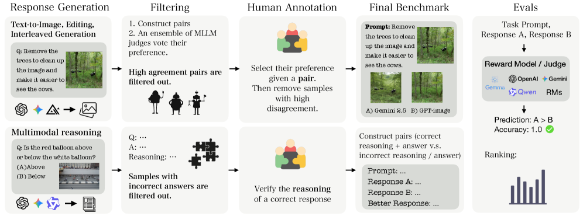
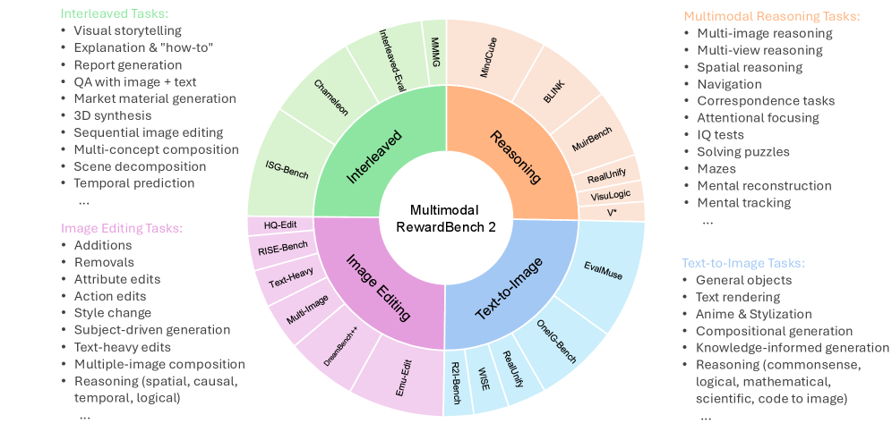
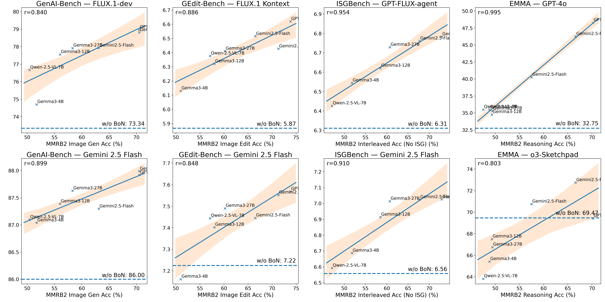

# MMRB2

## 📌 核心贡献

> 提出首个面向多模态理解与交错生成的综合性奖励模型基准 MMRB2，涵盖 4 类任务、4,000 个专家标注偏好对，系统评估了 23 个 SOTA 模型，揭示当前最强 AI 判官（Gemini 3 Pro ~76%）与人类（>90%）之间的显著差距。

## 📖 摘要

Reward models (RMs) are essential for training large language models (LLMs), but remain underexplored for omni models that handle interleaved image and text sequences. We introduce Multimodal RewardBench 2 (MMRB2), the first comprehensive benchmark for reward models on multimodal understanding and (interleaved) generation. MMRB2 spans four tasks: text-to-image, image editing, interleaved generation, and multimodal reasoning ("thinking-with-images"), providing 1,000 expert-annotated preference pairs per task from 23 models and agents across 21 source tasks. MMRB2 is designed with: (1) practical but challenging prompts; (2) responses from state-of-the-art models and agents; and (3) preference pairs with strong human-expert consensus, curated via an ensemble filtering strategy. Using MMRB2, we study existing judges for each subtask, including multimodal LLM-as-a-judge and models trained with human preferences. The latest Gemini 3 Pro attains 75-80% accuracy. GPT-5 and Gemini 2.5 Pro reach 66-75% accuracy, compared to >90% for humans, yet surpass the widely used GPT-4o (59%). The best performing open-source model Qwen3-VL-32B achieves similar accuracies as Gemini 2.5 Flash (64%). We also show that MMRB2 performance strongly correlates with downstream task success using Best-of-N sampling and conduct an in-depth analysis that shows key areas to improve the reward models going forward.

## 🔍 关键信息

| 字段 | 内容 |
|------|------|
| 机构 | Meta / FAIR |
| 发表 | 2025-12-18 |
| 分类 | cs.CL, cs.CV |
| 链接 | [arXiv](https://arxiv.org/abs/2512.16899), [GitHub](https://github.com/facebookresearch/MMRB2) |

## 📝 我的笔记

### 方法总览

### 核心问题/动机

当前奖励模型（RM）的研究主要集中在纯文本领域，对于**处理交错图文序列的全模态模型**（omni models）的评估严重不足。已有的多模态评估基准存在以下问题：

1. **任务覆盖不全**：缺少对图像编辑、交错生成、多模态推理等任务的评估
2. **难度不足**：传统指标（如 CLIPScore、ImageReward）在简单 prompt 上尚可工作，但在复杂 prompt 上已不可靠
3. **质量控制不够**：缺乏强人类共识的高质量偏好标注

### 基准设计

#### 四大任务类别

| 任务 | 输入 | 输出 | 关注点 | 数据源数量 |
|------|------|------|--------|-----------|
| **Text-to-Image** | 文本 prompt | 生成图像 | 组合、空间关系、属性绑定、文字渲染 | 5 个 |
| **Image Editing** | 1-3 张图 + 编辑指令 | 编辑后图像 | 指令忠实度、区域保持、多图合成 | 5 个 |
| **Interleaved Generation** | 多模态 prompt | 图文交错序列 | 连贯性、全局规划、视觉-文本协调 | 4 个 |
| **Multimodal Reasoning** | 复杂推理问题 | 推理轨迹（文本/图像） | 视觉理解、逻辑推断、多步推理 | 6 个 |

每个任务 **1,000 个偏好对**，共 **4,000 个**，来自 21 个源数据集。

#### 数据构建流程

**1. Prompt 收集**：从 21 个已有 benchmark 中分层采样，按覆盖度和难度加权。

**2. Response 生成**：每个 prompt 用 7-11 个 SOTA 模型生成多个 response：
- 生成类任务：Gemini 2.0/2.5 Flash Image, Imagen 3/4/Ultra, FLUX, GPT-Image-1, SD 3.5-L 等
- 交错/推理任务：构建专用 Agent（Python + 图像生成/编辑工具）

**3. 集成过滤**（Ensemble Filtering）：
- 9 个多模态判官（GPT-5, GPT-4.1, GPT-4o, Gemini 2.5 Flash/Pro, Gemma-3, Qwen-2.5-VL 等）
- 每对样本评估 2 次（位置互换，消除位置偏差）
- 判官一致性 >90% 的"简单对"被丢弃，保留有信息量的挑战样本

**4. 人类专家标注**：
- 通过 Surge AI 招募专业标注员（\$85/小时）
- 每对 3 名独立标注员，7 分 Likert 量表评估忠实度、质量、对齐度
- 过滤掉标注员评分跨度 >4 分或均值落在 3.0-4.0（模糊区间）的样本

**5. 质量指标**：最终过滤后的数据集标注员间一致性达 **95.6%**（生成 95.3%，编辑 96.3%，交错 95.2%）。

### 关键结果

#### MLLM-as-a-Judge 准确率

| 判官模型 | T2I | Editing | Interleaved | Reasoning | 平均 |
|----------|-----|---------|-------------|-----------|------|
| **闭源 API** | | | | | |
| Gemini 3 Pro | **74.4** | **74.9** | **76.4** | **79.5** | **76.3** |
| GPT-5 | 70.5 | 73.8 | 74.4 | 70.2 | 72.2 |
| Gemini 2.5 Pro | 70.5 | 71.3 | 75.1 | 66.6 | 70.9 |
| GPT-4.1 | 65.8 | 68.2 | 67.0 | 53.0 | 63.5 |
| Gemini 2.5 Flash | 63.1 | 66.5 | 69.4 | 57.5 | 64.1 |
| GPT-4o | 60.3 | 65.0 | 61.5 | 51.9 | 59.7 |
| **开源** | | | | | |
| **Qwen3-VL-32B** | **64.1** | **67.3** | **70.5** | **56.6** | **64.6** |
| Qwen3-VL-235BA22B | 62.0 | 64.8 | 69.0 | 55.9 | 62.9 |
| Qwen3-VL-8B | 59.4 | 61.7 | 61.5 | 54.6 | 59.3 |
| Qwen2.5-VL-72B | 59.1 | 64.6 | 62.3 | 50.0 | 59.0 |
| Gemma 3 27B | 58.3 | 60.2 | 61.1 | 49.4 | 57.3 |
| Gemma 3 12B | 56.0 | 58.0 | 58.0 | 49.3 | 55.3 |
| Gemma 3 4B | 51.7 | 51.0 | 51.3 | 48.8 | 50.7 |

核心发现：
- **人类 vs AI 差距显著**：人类准确率 >90%，最强 AI（Gemini 3 Pro）仅 76.3%
- **GPT-4o 已过时**：59.7% 的准确率表明它"不再适合评估前沿多模态模型"
- **最强开源模型** Qwen3-VL-32B (64.6%) 与 Gemini 2.5 Flash (64.1%) 相当

#### 监督式奖励模型对比

| 模型 | T2I | Editing* | Reasoning* |
|------|-----|----------|------------|
| PickScore | 58.6 | — | — |
| HPSv3 | 60.2 | — | — |
| UnifiedReward | 59.8 | — | 55.1 |
| EditReward | — | 67.2 | — |
| CLIPScore | 51.0 | — | — |
| ImageReward | 54.0 | — | — |
| HPSv2 | 54.7 | — | — |

*Editing 为单图子集；Reasoning 为纯文本输出子集

关键发现：**传统任务特定指标（VQAScore 58.3%、ImageReward 54.0%）已大幅落后于 MLLM 判官**，表明它们在复杂 prompt 上不再可靠。

#### 同模型 vs 跨模型判别

| 任务 | 判官 | 总体 | 同模型对 | 跨模型对 |
|------|------|------|----------|----------|
| Image Generation | Gemini 3 Pro | 74.4% | 70.4% | 79.7% |
| Image Editing | Gemini 3 Pro | 74.9% | 71.0% | 79.3% |
| Interleaved | Gemini 3 Pro | 76.4% | 72.8% | 82.0% |

跨模型对的准确率比同模型对高 **5-13 个百分点**，说明对同一模型的细粒度质量判别仍然具有挑战性。

#### 下游任务相关性

MMRB2 分数与下游 Best-of-N 采样成功率之间存在强相关性（Pearson r > 0.8），验证了该基准的实用价值。测试涵盖 GenAI-Bench、GEdit-Bench、ISG-Bench 和 EMMA 四个下游任务。

### 深入分析

#### 图像偏差问题
在混合模态推理对中，判官对**包含图像的回答存在强烈偏好偏差**：偏好含图像 response vs 偏好纯文本 response 的性能差距达 27.7-49.3 个百分点。

#### Test-Time Scaling 受限
与文本模型不同，多模态奖励模型从多数投票中获益极小：K=9 时仅提升 0.8-1.2%，远低于纯文本 LLM 基准。

#### 生成模型排名

| 任务 | 排名 | 模型 | 胜率 |
|------|------|------|------|
| T2I | 1 | GPT-Image-1 | 60.4% |
| T2I | 2 | Imagen 4 | 57.4% |
| T2I | 3 | Imagen 4 Ultra | 56.5% |
| Editing | 1 | Gemini 2.5 Flash | 59.2% |
| Editing | 2 | GPT-Image-1 | 53.2% |
| Interleaved | 1 | GPT-Gemini Agent | 57.1% |
| Interleaved | 2 | GPT-Image Agent | 56.9% |

### 总结

MMRB2 填补了多模态奖励模型评估的重要空白。几个值得关注的发现：

1. **传统指标的淘汰**：CLIPScore、ImageReward、HPSv2 等在复杂 prompt 上表现接近随机，VLM-based 判官（如 MLLM-as-a-Judge）已成为更可靠的替代方案
2. **推理能力是瓶颈**：多模态推理任务（thinking-with-images）是所有模型最薄弱的环节，即使 Gemini 3 Pro 也仅 79.5%
3. **图像偏差值得警惕**：判官倾向于偏好包含图像的回答，即使纯文本回答质量更高，这在 RLHF 训练中可能引入系统性偏差
4. **基准设计范例**：MMRB2 的集成过滤 + 人类验证的两阶段流程是构建高质量偏好数据集的良好范式

## 🔗 相关论文

**同方向：** [[UnifiedReward]], [[UnifiedReward-Flex]], [[ImageReward]], [[HPSv2]], [[HPSv3]], [[PickScore]], [[VisionReward]]
