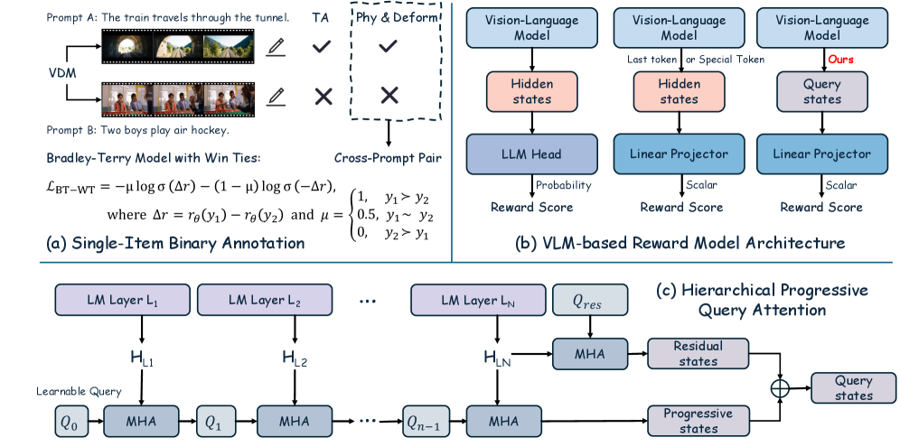
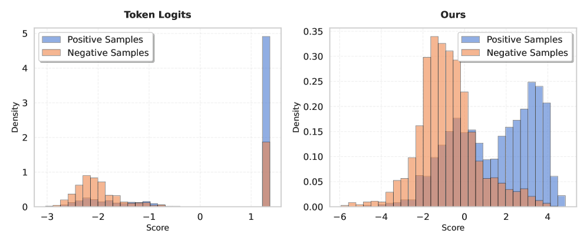
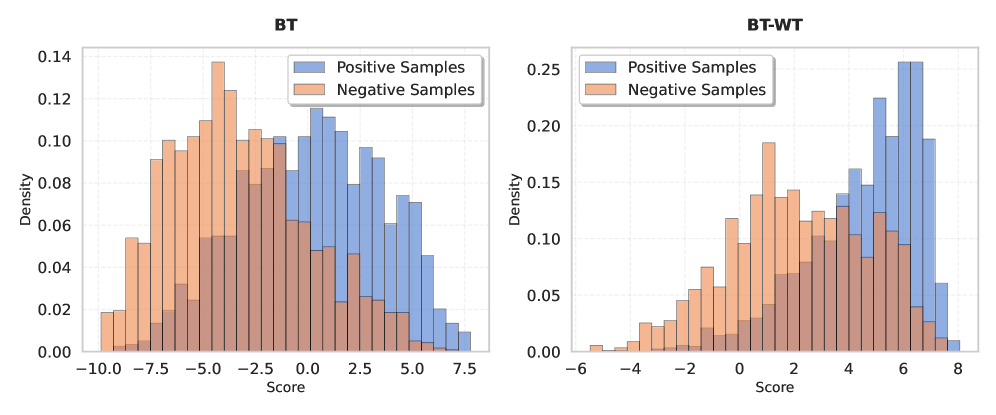

# SoliReward

## 📌 核心贡献

> 从数据标注（single-item binary + cross-prompt pairing）、训练目标（BT-WT loss 正则化正样本分布）、模型架构（HPQA 多层渐进式聚合）三个层面系统性解决视频生成 RM 的 reward hacking 和标注噪声问题，并揭示 RM accuracy 脱离 reward margin 时具有欺骗性。

## 📖 摘要

The research addresses challenges in training reward models for video generation. The team tackles issues including labeling noise from annotation methods and vulnerabilities to reward hacking. Their solution involves three main components: gathering high-quality training data through single-item binary annotations paired using cross-prompt strategies, implementing a Hierarchical Progressive Query Attention mechanism for improved feature processing, and adapting the Bradley-Terry loss function to handle win-tie outcomes. This approach regularizes the RM's score distribution for positive samples, yielding more balanced preference signals during model optimization.

## 🔍 关键信息

| 字段 | 内容 |
|------|------|
| 机构 | Tencent |
| 发表 | 2025-12-17 |
| 分类 | cs.LG, cs.CV |
| 链接 | [arXiv](https://arxiv.org/abs/2512.22170) |

## 📝 我的笔记

### 方法总览

### 核心问题/动机

视频生成 RM 训练面临三个关键挑战：
- **标注噪声**：同 prompt 下的 pairwise 偏好标注在质量相近时产生歧义；逐点评分存在标注者间分歧
- **Reward Hacking**：仅用 win-lose 对训练的 RM 缺乏对正样本分布的约束，模型可利用 shortcut features 获取高奖励
- **架构局限**：现有 VLM-based RM 使用简单池化策略，无法捕获跨 transformer 层的信息

### 方法

#### 1. 数据标注：Single-Item Binary Classification

放弃 pairwise 比较，改为对单个视频进行 Pass/Fail 二分类标注，覆盖三个维度：
- **Physical Plausibility**（物理合理性）
- **Subject Deformity**（主体变形）
- **Semantic Alignment**（语义对齐）

标注一致性显著提升：Krippendorff's α = 0.4939（vs pairwise 的 0.3516，提升 ~40%）。

数据规模：250k 训练视频 + 50k OOD 测试视频，来自 20k unique prompts。

#### 2. Cross-Prompt Pairing Strategy

从二分类标签构建偏好对：
- 所有 Pass 样本互相等价
- 所有 Pass 样本优于所有 Fail 样本
- **偏好对可来自不同 prompt**（突破传统 in-prompt 限制）

效果：提升数据利用率，性能与 in-prompt 方法持平。

#### 3. Bradley-Terry with Win-Tie (BT-WT) Loss

标准 BT loss 仅约束正负样本间的 margin，允许某些正样本获得不成比例的高奖励：

$$\mathcal{L}_{\text{BT}} = \mathbb{E}_{(y_i, y_j) \in D} [-\log(\sigma(r_\theta(y_i) - r_\theta(y_j)))]$$

**BT-WT 改进**：

$$\mathcal{L}_{\text{BT-WT}} = \mathbb{E}_{(y_i, y_j) \in W \times (W \cup L)} [-\mu \log \sigma(\Delta r) - (1-\mu) \log \sigma(-\Delta r)]$$

其中 $\mu = 1$ if $y_i \succ y_j$（win），$\mu = 0.5$ if tie。

**核心洞察**：Tie-loss（$\mu=0.5$）显式惩罚正样本集内的分数方差，迫使正样本在 reward space 中形成**紧凑稠密的流形**，减少 group advantage variance，防止 over-optimization。

#### 4. Hierarchical Progressive Query Attention (HPQA)

传统方法从 last-token embedding 或 special token 提取 reward，导致 **score clustering**（退化为离散分布）。

HPQA 逐层聚合多层特征：

$$q^{(1)} = \text{MHA}_1(Q=q^{(0)}, K=H_{l_1}, V=H_{l_1})$$

$$q^{(i)} = \text{MHA}_i(Q=q^{(i-1)}, K=H_{l_i}, V=H_{l_i}), \quad i=2,\ldots,N$$

残差连接：

$$o_{\text{res}} = \text{MHA}_{\text{res}}(Q=q_{\text{res}}, K=H_L, V=H_L)$$

最终 reward：

$$r = \text{RewardHead}(q_{\text{prog}} + o_{\text{res}})$$

融合低层视觉保真度特征与高层语义理解，残差连接确保层级信息**增强而非替代**最终层表示。

### 关键结果

#### RM Accuracy

| 任务 | SoliReward (ID/OOD) | VideoAlign | VideoPhy |
|------|---------------------|------------|----------|
| Phy & Deform | 78.48 / 80.08 | 54.40 / 71.60 | 67.35 / 65.10 |
| Semantic | 79.02 / 60.25 | 49.50 / 49.14 | 54.85 / 60.52 |

#### Post-Training（HunyuanVideo + DanceGRPO）

| RM | Motion Quality | SoliReward Score | VBench2 |
|----|----------------|------------------|---------|
| Baseline | -0.0980 | 4.5628 | 0.8426 |
| VideoAlign MQ | 0.1607 | 4.8968 | 0.8695 |
| **SoliReward** | **0.3302** | **5.3554** | **0.8999** |

#### BT vs BT-WT（关键对比）

| Loss | ACC | VBench2 | MQ |
|------|-----|---------|-----|
| BT | 77.63 | 0.8693 | 0.1719 |
| **BT-WT** | **78.27** | **0.8999** | **0.3302** |

RM accuracy 仅差 0.64，但 post-training 性能差距巨大 → **"RM accuracy 在脱离 reward margin 时具有欺骗性"**。

### Ablation

| 架构 | ID ACC | OOD ACC |
|------|--------|---------|
| Linear head | 74.69 | 78.66 |
| 'Yes' token logits | 75.43 | 78.46 |
| Special token + Linear | 75.91 | 73.61 |
| **HPQA** | **78.48** | **80.08** |

Scaling：1B→8B 提升显著（OOD +3.78），8B→14B 收益递减（capacity saturation + 数据受限）。

BCE penalty（RewardDance 方式）导致 reward margin 坍缩 19.62%，post-training 性能下降 → 与 RewardDance 的结论形成有趣对比。

### 总结

核心发现是 RM accuracy 不足以衡量 RM 质量，reward margin 同样关键。BT-WT loss 通过 tie 约束实现隐式正则化，是一种简洁有效的 reward hacking 缓解方案。

## 🔗 相关论文

**基于/改进自：** —

**同方向（reward model）：** [[RewardDance]]
