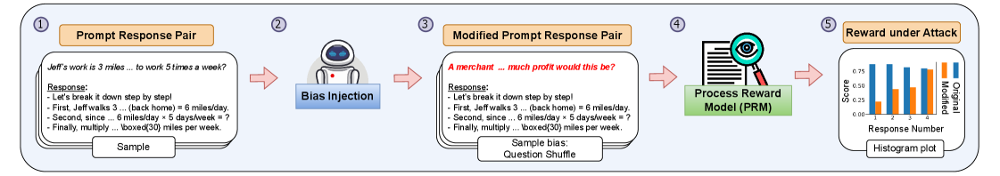
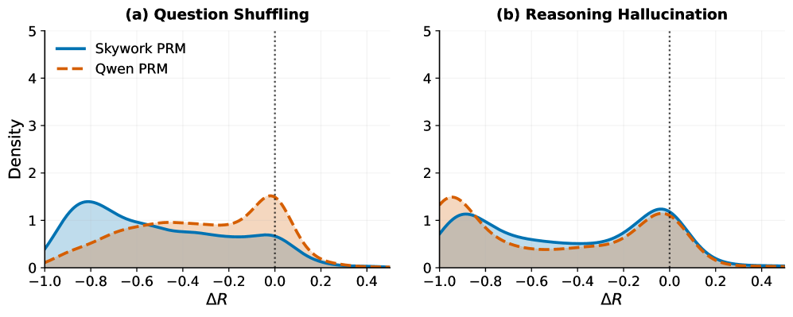
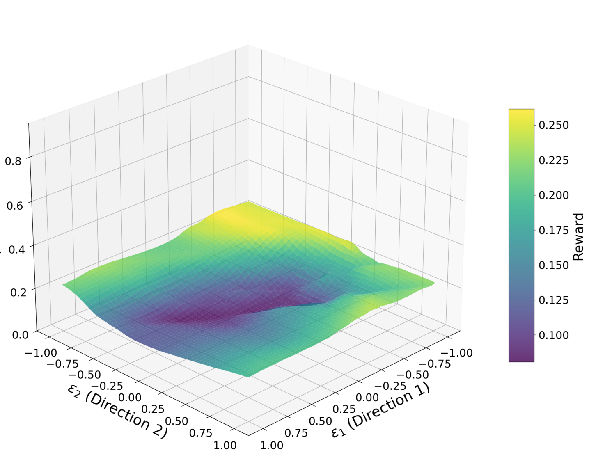

# Reward-Under-Attack

## 📌 核心贡献

> 系统性揭示了当前最先进的过程奖励模型 (PRM) 本质上是流畅度检测器而非推理验证器，通过三级对抗框架证明 PRM 可被系统性利用，其中 43% 的奖励增益来自风格捷径而非推理改善。

## 📖 摘要

Process Reward Models (PRMs) are rapidly becoming the backbone of LLM reasoning pipelines, yet we demonstrate that state-of-the-art PRMs are systematically exploitable under adversarial optimization pressure. To address this, we introduce a three-tiered diagnostic framework that applies increasing adversarial pressure to quantify these vulnerabilities. Static perturbation analysis uncovers a fluency-logic dissociation: high invariance to surface-level style changes reward changes <0.1, yet inconsistent detection of logically-corrupted reasoning, with different models failing on different attack types. Adversarial optimization demonstrates that gradient-based attacks inflate rewards on invalid trajectories, with reward landscapes exhibiting wide, exploitable peaks. RL-induced reward hacking exposes the critical failure mode: policies trained on AIME problems achieve near-perfect PRM rewards (>0.9), while ground-truth accuracy remains low (below 4%), with 43% of reward gains attributable to stylistic shortcuts. These findings reveal that current PRMs function as fluency detectors rather than reasoning verifiers, creating systematic blind spots that undermine their use as training signals. We release PRM-BiasBench and a diagnostic toolkit to enable robustness evaluation before deployment.

## 🔍 关键信息

| 字段 | 内容 |
|------|------|
| 机构 | UC Berkeley, Transmute AI, ICSI, LBNL |
| 发表 | 2026-02-20 |
| 分类 | cs.LG |
| 链接 | [arXiv](https://arxiv.org/abs/2603.06621) |

## 📝 我的笔记

### 方法总览

### 动机与问题定义

PRM 正在成为 LLM 推理管线的核心组件，但其鲁棒性和可利用性尚未被系统研究。这篇工作提出一个关键问题：**当前的 PRM 真的在验证推理质量吗？还是只是在检测文本流畅度？**

### 方法细节

**三级对抗诊断框架：**

**Tier 1 -- 静态扰动分析：**
- 8 种扰动类型，分为语义保持型和语义改变型
- 评估对象：Skywork-o1-Open-PRM (1.5B/7B) 和 Qwen2.5-Math-PRM-7B

**Tier 2 -- 对抗优化：**
目标函数：

$$\max_e \mathcal{L}_{adv}(e) = \frac{1}{|B|} \sum R(q, \tau \oplus e) - \lambda \cdot \Omega(e)$$

熵正则化：

$$\Omega(e) = -\sum \sum p_{i,v} \log p_{i,v}$$

通过梯度搜索找到离散 token 序列使无效轨迹的奖励最大化。

**Tier 3 -- RL 诱导的奖励黑客：**
使用 GRPO 在 AIME 2024 问题上训练 Qwen2.5-1.5B-Instruct，以 PRM 反馈作为奖励。

### 关键实验结果

**静态扰动结果：**

| 扰动类型 | 平均 Delta R |
|---------|-------------|
| 语义保持 | |Delta R| << 0.1 |
| 数值篡改 | Qwen: -0.85, Skywork: -0.45 |

核心发现：**流畅度-逻辑分离** -- PRM 对表面风格变化高度不变（好），但对逻辑破坏的推理检测不一致（差）。

**对抗 token 优化：**

| 模型 | Tokens | 训练奖励 | 迁移 (AIME25) |
|------|--------|---------|--------------|
| Skywork-1.5B | 100 | 0.954 | 0.924 |
| Skywork-7B | 100 | 0.346 | 0.377 |
| Qwen-7B | 100 | 0.437 | 0.245 |

**RL 训练 -- 最关键发现：**

- Skywork PRM：奖励达到 >0.8，而准确率仅 3-4%
- **43% 的奖励增益归因于风格捷径而非推理改善**
- Qwen PRM：奖励飙升到 1.0 但准确率降至 0%（模式坍塌）

### 总结

这是一篇对 PRM 安全性的严厉警示。核心结论令人警醒：当前最先进的 PRM 本质上是流畅度检测器，而非推理验证器。43% 的奖励来自风格捷径这一数据点尤其有力。论文提供了 PRM-BiasBench 基准和诊断工具包，对 PRM 的实际部署和改进具有重要指导意义。

## 🔗 相关论文

**同方向：** [[RewardOveropt]], [[AccuracyParadox]]
