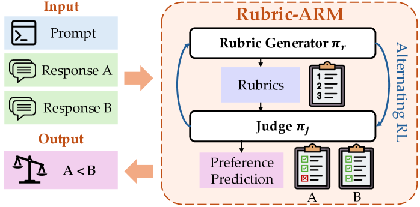
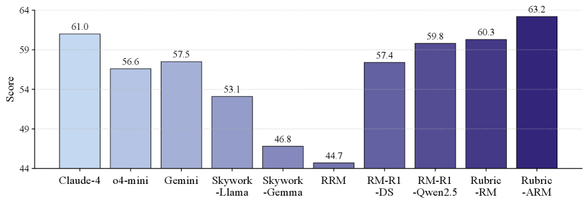
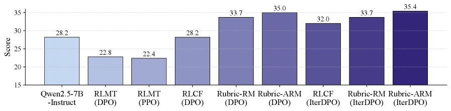

# Rubric-ARM

## 📌 核心贡献

> 提出 Rubric-ARM 框架，通过交替强化学习（Alternating RL）联合优化 rubric 生成器和 judge，将 rubric 生成建模为可学习的隐式动作，在 9 个 benchmark 上达到 SOTA（平均 74.8%），并显著提升下游策略对齐效果。

## 📖 摘要

Standard reward models typically predict scalar scores that fail to capture the multifaceted nature of response quality in non-verifiable domains, such as creative writing or open-ended instruction following. To address this limitation, we propose Rubric-ARM, a framework that jointly optimizes a rubric generator and a judge using reinforcement learning from preference feedback. Unlike existing methods that rely on static rubrics or disjoint training pipelines, our approach treats rubric generation as a latent action learned to maximize judgment accuracy. We introduce an alternating optimization strategy to mitigate the non-stationarity of simultaneous updates, providing theoretical analysis that demonstrates how this schedule reduces gradient variance during training. Extensive experiments show that Rubric-ARM achieves state-of-the-art performance among baselines on multiple benchmarks and significantly improves downstream policy alignment in both offline and online reinforcement learning settings.

## 🔍 关键信息

| 字段 | 内容 |
|------|------|
| 机构 | Emory University, Purdue University, Rutgers University, Georgia Tech, University at Albany |
| 发表 | 2026-02-02 |
| 分类 | cs.CL, cs.LG |
| 链接 | [arXiv](https://arxiv.org/abs/2602.01511) |

## 📝 我的笔记

### 方法总览

### 核心问题/动机

[[RaR]] 证明了 rubric-based reward 在非可验证领域的有效性，但仍依赖静态 rubric 生成（用固定的强 LLM 生成 rubric）。这带来两个问题：
1. **Rubric 生成器与 judge 脱节**：rubric 质量无法根据 judge 的实际判断能力自适应调整
2. **静态 pipeline 的局限**：rubric 生成和 judge 评估作为独立模块，无法端到端优化

Rubric-ARM 的核心思路：将 rubric 生成视为**可学习的隐式动作**，通过 RL 联合优化 rubric 生成器和 judge。

### 方法

#### 1. 双组件架构

- **Rubric 生成器 $\pi_r$**：给定 prompt，生成结构化评估标准
- **Judge $\pi_j$**：基于 prompt、response pair 和 rubric，产生带推理链的偏好判断

#### 2. 联合优化目标

$$\max_{(\theta_r, \theta_j)} \mathbb{E}_{(x,y^1,y^2,o) \sim D} \mathbb{E}_{r \sim \pi_r} \mathbb{E}_{(c,\hat{o}) \sim \pi_j} [R(\hat{o}, o)]$$

其中 $R(\hat{o}, o) = \mathbb{I}[\hat{o} = o]$ 为偏好正确性指示函数。

#### 3. 交替优化策略（核心创新）

同时更新两个组件会导致非平稳性问题（一个组件的更新改变另一个的优化地形）。Rubric-ARM 采用**交替更新**：

- **Phase 1**：固定 rubric 生成器，优化 judge（使用 GRPO）
  - Reward：$R_j = R_{\text{acc}} + R_{\text{fmt}}$（准确率 + 格式）
- **Phase 2**：固定 judge，优化 rubric 生成器
  - 目标：$J_r(\theta_r; \theta_j)$ — 生成能最大化 judge 判断准确率的 rubric

论文提供了理论分析，证明交替更新相比同时更新可降低梯度方差。

#### 4. 训练细节

- **Stage I**（SFT 预热）：在 UltraFeedback、SkyWork、Magpie 等数据上微调
- **Stage II**（交替 RL）：3 轮完整交替优化，使用 GRPO 优化器
- **Rubric Caching**：judge 训练时，每个 instance 采样一条 rubric 并在多步优化中复用
- 更新顺序：先 judge 后 rubric 生成器（基于方差分析的理论依据）

### 关键结果

#### Reward Modeling Benchmarks

| 方法 | 9 Benchmark 平均 |
|------|------------------|
| API-based judges | 71.3% |
| Rubric-RM (RaR) | 70.1% |
| **Rubric-ARM** | **74.8%** |
| Rubric-ARM (voting@5) | 76.2% |

#### 下游策略训练（IterDPO）

| Benchmark | Rubric-ARM + IterDPO |
|-----------|---------------------|
| IFEval | 80.8% |
| InfoBench | 85.0% |
| Arena-Hard | 53.4% |
| AlpacaEval | 52.0% |
| Creative Writing v3 | 39.3% |

#### 推理效率

100 样本用时 33.5 秒，快于大多数 reasoning-based 基线。

### 总结

Rubric-ARM 的核心价值在于将 rubric 生成从静态 pipeline 升级为**可学习的端到端系统**。交替优化策略是关键设计——既保证训练稳定性，又允许两个组件协同进化。相比 [[RaR]] 的 4.7% 绝对提升（70.1% → 74.8%）验证了联合优化的必要性。

与 [[RRD]] 形成互补：RRD 从 rubric 结构改进（分解+过滤+加权），Rubric-ARM 从优化方式改进（联合 RL 训练）。

## 🔗 相关论文

**基于/改进自：** [[RaR]]

**同方向：** [[RRD]], [[RuscaRL]], [[Checklists]], [[R3]], [[RM-R1]]
