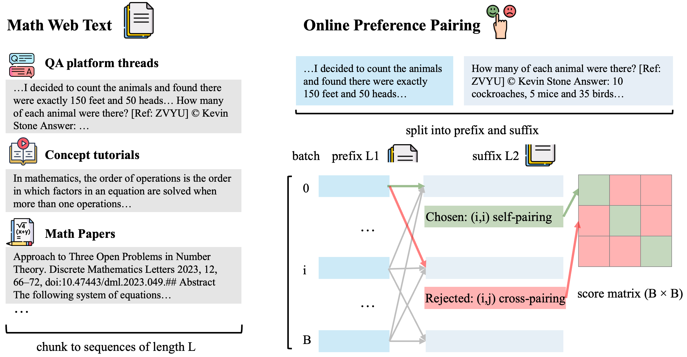
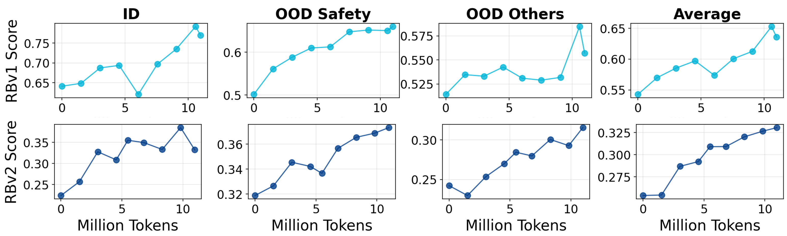

# ScalingRM

## 📌 核心贡献

> 提出无监督奖励模型扩展方法，将网络数学文本转化为前缀-后缀偏好对进行奖励学习，仅用 11M token 数学数据即在 RewardBench v2 上提升最多 7.7 分，域内数学子集提升达 16.1 分，无需任何人工标注。

## 📖 摘要

Learning from feedback is an instrumental process for advancing the capabilities and safety of frontier models, yet its effectiveness is often constrained by cost and scalability. We present a pilot study that explores scaling reward models through unsupervised approaches. We operationalize reward-based scaling (RBS), in its simplest form, as preference learning over document prefixes and suffixes drawn from large-scale web corpora. Its advantage is demonstrated in various aspects: despite using no human annotations, training on 11M tokens of math-focused web data yields steady gains on RewardBench v1 and v2, and these improvements consistently transfer across diverse initialization backbones spanning model families and scales. Across models, our method improves RewardBench v2 accuracy by up to +7.7 points on average, with gains of up to +16.1 on in-domain math subsets and consistent improvements on out-of-domain safety and general subsets. When applied to best-of-N selection and policy optimization, these reward models substantially improve downstream math performance and match or exceed strong supervised reward model baselines of similar size. Overall, we demonstrate the feasibility and promise of training reward models without costly and potentially unreliable human annotations.

## 🔍 关键信息

| 字段 | 内容 |
|------|------|
| 机构 | Harvard University, Cornell University, Microsoft Research |
| 发表 | 2026-02-11 |
| 分类 | cs.LG |
| 链接 | [arXiv](https://arxiv.org/abs/2603.02225) |

## 📝 我的笔记

### 方法总览

### 动机与问题定义

奖励模型训练的核心瓶颈：**人工标注数据的成本和可扩展性**。高质量偏好数据的获取昂贵且潜在不可靠。这篇工作探索了一个根本性问题：能否完全不依赖人工标注来训练有效的奖励模型？

### 方法细节

**核心思路 -- 奖励基于扩展 (Reward-Based Scaling, RBS)：**

将连续文本序列转化为偏好对：
1. 在连续文本中随机选取断点，创建前缀-后缀对
2. 原始续写视为 "chosen" 响应
3. 批内交叉续写作为隐式负例

**训练损失 (Bradley-Terry)：**

$$\mathcal{L}_{BT} = \frac{1}{B}\sum_{i=1}^{B}\frac{1}{B-1}\sum_{j \neq i} -\log\sigma(s_\theta(p_i, r_i) - s_\theta(p_i, r_j))$$

**分数居中正则化：**

$$\mathcal{L}_{center} = \mathbb{E}[s_\theta(p_i, r_i)^2 + \frac{1}{B-1}\sum_{j \neq i} s_\theta(p_i, r_j)^2]$$

防止输出幅度过大，稳定 Best-of-N 选择。

**基础模型：** Llama-3.2 (1B, 3B) 和 Qwen2.5 (3B, 7B)

### 关键实验结果

| 指标 | 提升 |
|------|------|
| RewardBench v2 平均 | +7.7 points |
| 域内数学 | +16.1 points |
| 域外安全 | +5.4 points |
| 训练数据量 | 仅 11M tokens |

**Best-of-N 结果（FineMath-RM-Qwen-2.5-7B）：**
- 与有监督基线 (Skywork-Reward-V2) 在 MATH500 和 Toxigen 上竞争力相当
- GSM8K + Llama-3.1-8B actor：+5.2 MAP

**策略优化（GRPO）：**

| 任务 | 模型 | 准确率 |
|------|------|-------|
| MATH | Llama-3.2-3B | 0.420 |
| GSM8K | Llama-3.1-8B | 0.886 |

### 关键设计选择

消融实验揭示了几个重要设计选择：
- **数据质量**：FineMath > InfiwebMath
- **分割方式**：句子感知分割 > 任意断点
- **居中损失**：对 Best-of-N 稳定性至关重要
- **批大小**：影响负例质量

### 总结

这篇工作展示了一个优雅且实用的思路：利用网络文本的自然连贯性作为隐式偏好信号。仅 11M token 数学数据就能训练出与有监督基线竞争的奖励模型，证明了无监督奖励建模的可行性。方法简单、可扩展，对降低 RM 训练成本有重要意义。来自 Harvard 和 MSR 的团队，研究质量高。

## 🔗 相关论文

**同方向：** [[Self-Rewarding]], [[RLAIF]], [[Nemotron-4]]
