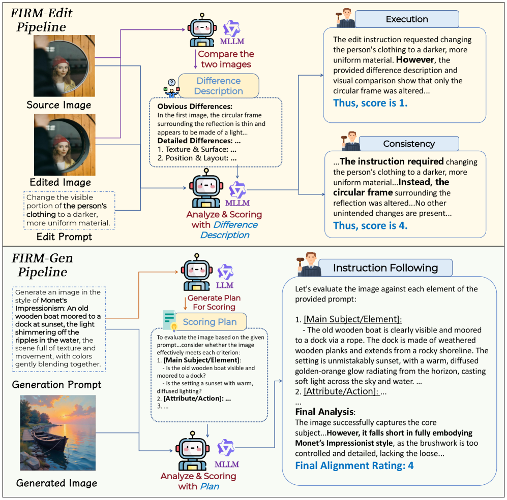
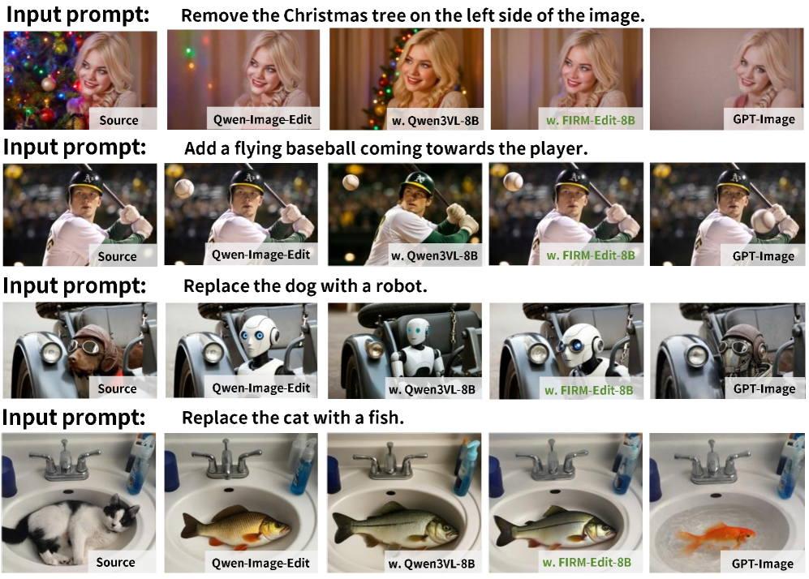
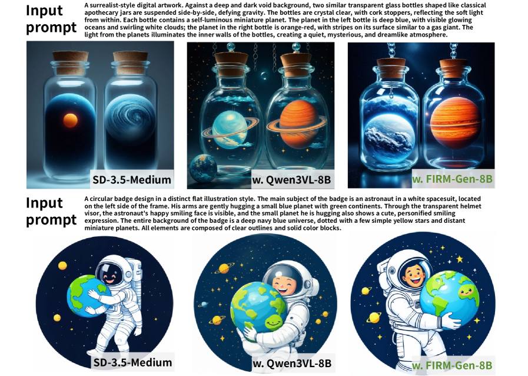

# FIRM

## 📌 核心贡献

> 提出 FIRM（Faithful Image Reward Modeling），针对图像编辑和生成分别设计鲁棒的奖励模型（FIRM-Edit-8B 和 FIRM-Gen-8B），通过 "Difference-First" 和 "Plan-Then-Score" 数据构建策略以及 Base-and-Bonus 奖励公式有效防止奖励黑客攻击。

## 📖 摘要

The paper addresses how reward models often suffer from hallucinations and assign noisy scores in image generation tasks. The authors introduce FIRM, which develops specialized reward models through curated datasets (FIRM-Edit-370K and FIRM-Gen-293K) and implements a "Base-and-Bonus" reward strategy balancing competing objectives. The resulting models achieve improvements in fidelity and instruction adherence over existing approaches.

## 🔍 关键信息

| 字段 | 内容 |
|------|------|
| 机构 | SJTU, Shanghai AI Lab, WHU, BUPT, CUHK, Fudan |
| 发表 | 2026-03-12 |
| 分类 | cs.CV |
| 链接 | [arXiv](https://arxiv.org/abs/2603.12247) |

## 📝 我的笔记

### 方法总览

### 动机与问题定义

现有图像奖励模型存在两个核心问题：
1. **幻觉问题**：奖励模型可能产生与实际图像质量不符的评分
2. **噪声评分**：评分不稳定，导致 RL 优化时容易被利用（reward hacking）

FIRM 针对图像编辑和生成两个场景分别设计专用奖励模型。

### 方法细节

**基础模型：** Qwen3-VL-8B-Instruct

**FIRM-Edit 流程 ("Difference-First")：**
核心观察：MLLM 擅长描述图像差异，但在直接评估时困难。
1. 提示 MLLM 识别原始图像和编辑图像之间的双层视觉差异
2. 将差异描述输入评估器 MLLM 进行打分（执行度 1-5，一致性 1-5）

**FIRM-Gen 流程 ("Plan-Then-Score")：**
1. Qwen3-32B LLM 根据生成 prompt 创建详细评分清单
2. Qwen3-VL-235B MLLM 根据结构化标准评估图像，减少"注意力稀释"问题

**关键奖励公式 -- Base-and-Bonus：**

编辑任务（一致性调制执行 CME）：

$$R_{CME} = \text{Execution} \times (0.6 + 0.4 \times \text{Consistency})$$

生成任务（质量调制对齐 QMA）：

$$R_{QMA} = \text{InstructionFollowing} \times (0.4 + 0.6 \times \text{Quality})$$

乘法耦合可防止奖励黑客攻击，确保多目标平衡优化。

**数据集：**
- FIRM-Edit-370K：编辑场景标注数据
- FIRM-Gen-293K：生成场景标注数据

### 关键实验结果

**FIRM-Bench 人类对齐评估：**

| 模型 | Edit Exec MAE | Edit Consist MAE | Gen MAE |
|------|-------------|-----------------|---------|
| GPT-5 | 0.62 | 0.73 | 0.52 |
| Qwen3-VL-235B | 0.72 | 0.91 | 0.56 |
| **FIRM-Edit-8B** | **0.53** | **0.73** | - |
| **FIRM-Gen-8B** | - | - | **0.51** |

FIRM-Edit-8B（8B 参数）在编辑执行评估上超越 GPT-5，FIRM-Gen-8B 在生成评估上与 GPT-5 持平。

**下游任务性能：**

| 任务 | 方法 | 分数 |
|------|------|------|
| 图像编辑 (GEditBench) | FIRM-Qwen-Edit | 7.84 (+0.30) |
| 图像生成 (UniGenBench++) | FIRM-SD3.5 | 76.22 (+11.55) |

**消融：** 加权平均（0.5:0.5）得分仅 1.06，而 CME 公式得分 7.84 -- 乘法耦合至关重要。

### 总结

FIRM 的核心创新在于：(1) 针对编辑和生成场景分别设计数据构建策略；(2) Base-and-Bonus 乘法奖励公式有效防止 reward hacking。8B 模型超越 GPT-5 的结果说明专用 RM 的价值。项目资源开源：[GitHub](https://github.com/VisionXLab/FIRM-Reward)。

## 🔗 相关论文

**同方向：** [[ImageReward]], [[VisionReward]]
